# LABMEDIS — Modèle de données

**Projet :** Plateforme de gestion dépositaire pharmaceutique LABMEDIS (achats internationaux, stock par lot, tarification, distribution, ventes, prévision)
**Version :** 1.0 — modèle de données validé
**Date :** 28 août 2026
**Moteur cible :** PostgreSQL (16.15, testé)

---

## Bandeau de statut

| Indicateur | Valeur | Preuve |
|---|---|---|
| Tables | **55** | `information_schema.tables`, introspection réelle |
| Colonnes | **636** | `information_schema.columns` |
| Clés primaires | **55** | une par table, UUID |
| Clés étrangères | **112** | toutes avec `ON DELETE` explicite et justifié |
| Index uniques (dont 55 PK) | **85** | dont 30 contraintes d'unicité métier hors PK, plusieurs partielles (`WHERE deleted_at IS NULL`) |
| Index secondaires (hors PK) | **101** | `pg_indexes` |
| Triggers | **55** | maintien de `updated_at` (un par table) |
| Contraintes CHECK métier explicites | **51** | dont 27 énumérations de statut (`VARCHAR + CHECK IN (...)`) |
| Références polymorphes documentées | **3** | `audit_logs`, `stock_movements`, `notifications` — sans FK stricte, assumé (règle 2.5) |
| Diagrammes Mermaid | **13** | 1 diagramme maître, 8 ERD de domaine, 4 diagrammes de séquence — **tous validés par un parseur réel** (`mermaid` + `jsdom`, sans navigateur headless) |
| Exécution du script complet | ✅ **réelle** | recréation de la base + `psql -v ON_ERROR_STOP=1` après chaque domaine ajouté, puis une dernière fois sur le document assemblé (Phase 6.6) |
| Scénario de bout en bout | ✅ **inséré et interrogé réellement** | cf. §8, 8 domaines exercés, résultats vérifiés ligne à ligne contre les valeurs réelles de `Structure_de_prix.xlsx` |
| `EXPLAIN (ANALYZE, BUFFERS)` | ✅ **exécuté sur volume réaliste** | 12 400 lots synthétiques générés pour un test d'index honnête (cf. §8) |

Ce document, `schema.sql` et le résumé conversationnel constituent les trois livrables de la mission. Aucune affirmation de validation ci-dessous ne repose sur une relecture mentale : chaque preuve renvoie à une commande réellement exécutée dans le sandbox de développement.

---

## 1. Méthodologie suivie

### 1.1 Ce qui a été lu

Les 12 fichiers fournis ont été lus **intégralement**, y compris ceux non affichés automatiquement en contexte du fait de leur taille : `PRD_CLAUDE.md` (56 Ko) et les modules `PRD_Qwen` 2 à 6 (260 Ko cumulés). Une clarification factuelle s'impose : le texte de mission en 6 phases n'est **pas** l'un des 12 fichiers uploadés — c'est le message collé directement dans la conversation. `PRD_CLAUDE.md`, lui, est un document livrable à part entière : un PRD indépendant et le plus abouti des sources (contexte réglementaire togolais/UEMOA inclus, hypothèses et questions ouvertes explicitées).

Les trois fichiers Excel (`Liste_des_clients_et_fournisseurs.xlsx`, `Liste_des_produits_actualisée_LABMEDIS.xlsx`, `Structure_de_prix.xlsx`) ont été lus ligne par ligne via `openpyxl`, sans échantillonnage, et leurs chiffres recoupés programmatiquement (comptage exact des catégories, des doublons, vérification arithmétique de la cascade de prix).

### 1.2 Conventions de modélisation retenues

Conformément au cadrage de la mission (section 2.5) :

- Clés primaires en `UUID` (`gen_random_uuid()`, natif PostgreSQL ≥ 13, vérifié disponible sans extension).
- `snake_case`, tables au pluriel, FK nommées `[table_singulier]_id`.
- Statuts en `VARCHAR + CHECK (... IN (...))`, jamais d'`ENUM` natif — 27 colonnes de ce type.
- `created_at` / `updated_at` (trigger `set_updated_at()`, seul trigger du modèle — un invariant qui ne peut pas vivre sereinement en couche applicative) / `deleted_at` (soft delete) sur toutes les tables métier.
- Unicité compatible avec le soft delete : les contraintes d'unicité métier (désignation produit, numéro de commande, email...) sont des **index uniques partiels** (`WHERE deleted_at IS NULL`), pas des contraintes `UNIQUE` classiques — testé réellement (§8.5) : une désignation redevient disponible après suppression logique, sans jamais permettre un doublon parmi les lignes actives.
- Chaque FK précise son `ON DELETE`, avec une politique générale documentée une fois plutôt que 112 fois de façon identique (cf. §9.3), et un commentaire ponctuel uniquement quand une FK déroge à la politique générale.
- Aucune contrainte SQL figée sur une valeur mouvante dans le temps (ex. un écart d'inventaire n'est jamais une colonne générée comparant deux valeurs qui évoluent indépendamment — le calcul vit en couche service, cf. commentaire sur `inventory_counts`).
- Toute donnée financière transactionnelle est figée en instantané sur l'enregistrement (`stock_lots.unit_cost_cfa`, `product_prices.pv_ht_applied`, `invoice_lines.vat_rate`...), en plus d'exister dans une table de configuration versionnée (`pricing_profiles`, `exchange_rates`).
- Trois références polymorphes assumées explicitement (jamais de FK stricte vers une cible variable) : `audit_logs.entity_type/entity_id`, `stock_movements.source_document_type/id`, `notifications.source_document_type/id`.

### 1.3 Ce qui a été réellement testé (Phase 3)

1. **Exécution du script domaine par domaine.** Après l'ajout de chaque nouveau domaine, la base a été recréée à vide (`dropdb`/`createdb`) et le script cumulé exécuté avec `psql -v ON_ERROR_STOP=1` — 8 exécutions réussies, dans cet ordre : Sécurité → Référentiel Commercial → Pricing & Devises → Achats & Logistique → Entreposage & Stock → Ventes & Facturation → Prévision MRP → Reporting & Notifications (ordre choisi pour qu'aucune FK ne pointe vers un domaine défini plus tard).
2. **Scénario métier de bout en bout inséré avec de vraies données**, alignées sur les chiffres réels vérifiés de `Structure_de_prix.xlsx` (gamme France Lait) : un utilisateur multi-rôles, une commande fournisseur complète avec historique de statuts, une expédition maritime, deux lots au même produit avec des péremptions différentes, une vente avec allocation FEFO, une livraison, une facture, un retour partiel avec avoir, un calcul de prévision MRP déclenchant une suggestion de commande, une notification et un log d'audit. Détail et résultats vérifiés en §8.
3. **Contraintes réellement éprouvées, pas seulement déclarées** : une tentative de suppression d'un fournisseur encore référencé a été rejetée par PostgreSQL (`ON DELETE RESTRICT` réel) ; une tentative d'insertion de lot avec `remaining_quantity > initial_quantity` a été rejetée par la contrainte `CHECK` (découverte en cours de génération de données de test, non anticipée — preuve que la contrainte est active et non un vœu pieux dans un commentaire) ; l'index unique partiel a été vérifié en conditions réelles de suppression logique.
4. **`EXPLAIN (ANALYZE, BUFFERS)`** sur deux requêtes sensibles à la performance, contre un volume synthétique de 12 400 lots (une table quasi vide aurait rendu le test malhonnête : l'optimiseur PostgreSQL préfère à raison un balayage séquentiel sur une poignée de lignes, ce qui n'aurait rien prouvé sur l'usage réel de l'index).
5. **13 diagrammes Mermaid validés par un vrai parseur** (`mermaid` + `jsdom`, sans navigateur headless — le rendu visuel complet exige Chromium, indisponible en sandbox ; le *parsing* syntaxique n'en a pas besoin et suffit à détecter les erreurs). Le parseur a effectivement détecté deux erreurs réelles en cours de rédaction (points-virgules dans du texte de message de séquence, incompatibles avec la grammaire Mermaid) — corrigées puis revalidées.

Là où l'exécution réelle n'était pas possible (rendu visuel complet des diagrammes), cela est dit explicitement plutôt que simulé : la relecture manuelle du rendu visuel final (au-delà du parsing syntaxique) reste à faire par un humain ouvrant les fichiers `.mmd` dans un éditeur Mermaid.

---

## 2. Comparaison avec le brouillon initial

`PRD_CLAUDE.md` contient, en section 9, un schéma conceptuel simplifié (17 entités, un diagramme Mermaid `erDiagram` sommaire). Ce n'est pas un modèle de données détaillé (pas de types, pas de contraintes, pas d'index) mais c'est le seul brouillon structurel préexistant parmi les sources : il sert de point de comparaison, conformément à la Phase 1.5 de la mission. Le modèle livré ici n'a pas remplacé ce brouillon à l'aveugle — chaque écart significatif est tracé ci-dessous vers le document source qui l'exige.

| Lacune constatée dans le brouillon PRD_CLAUDE §9 | Document source qui l'exige | Solution apportée dans ce modèle |
|---|---|---|
| RBAC réduit à `Utilisateur.rôle(s)` (texte), sans rôles/permissions explicites | PRD_Qwen-5 §5.5 ("le RBAC doit être représenté par des tables explicites, jamais par un simple champ texte libre") ; règle 2.6 de la mission | `roles`, `permissions`, `role_permissions`, `user_roles`, `user_permission_exceptions` (5 tables, domaine 1) |
| Aucune table d'audit (seul `ILoggerManager`/NLog, fichier) | PRD_Qwen-5 §5.8.2 (entité `AuditLog`) | `audit_logs`, avec référence polymorphe documentée |
| Aucun jeton de renouvellement persisté | PRD_Qwen-5 §5.3.3 ("le Refresh Token doit être stocké côté backend avec expiration... révocable") | `refresh_tokens` |
| Licence de dépositaire mentionnée en prose (PRD_CLAUDE §17.1) mais absente de son propre modèle §9 | PRD_CLAUDE §17.1 lui-même (incohérence interne prose/modèle) | `company_profile` |
| Classe thérapeutique et fournisseur multiple = attributs bruts sur `Produit` | PRD_CLAUDE §8.1.2 et §8.1.6 eux-mêmes ("listes contrôlées", "un ou plusieurs fournisseurs habituels") | `therapeutic_classes` (référentiel), `product_suppliers` (association N:N) |
| Coefficients de coût attachés directement au `Lot`, non réutilisables/paramétrables | PRD_Qwen-1 §1.2 ("les coefficients ne doivent jamais être codés en dur... stockés en base pour permettre à la direction de les ajuster") | `pricing_profiles`, réutilisé par plusieurs lots/produits |
| `Expedition` liée à une seule `CommandeAchat` (FK directe) | PRD_Qwen module 3 §3.5.4 (une expédition peut consolider plusieurs commandes) — **[CONTRADICTION]**, cf. §9.1 | `shipment_lines` référence `purchase_order_lines`, jamais l'entête de commande |
| Aucun registre des frais logistiques réels | PRD_Qwen module 3 §3.5.3/§US-LOG-02 | `import_costs` |
| Aucun historique de statut (`Statut` = simple champ) | PRD_Qwen module 3 §US-ACH-03 ("chaque changement de statut est horodaté") | `purchase_order_status_history`, `sale_order_status_history` |
| `Lot` implicitement mono-emplacement | PRD_Qwen-2 §2.3.3 ("un même lot peut être stocké à plusieurs emplacements") | `stock_lot_locations` (association N:N avec quantité réservée) |
| Aucune gestion d'inventaire | PRD_Qwen-2 §2.8 (workflow complet) | `inventory_sessions`, `inventory_counts` |
| **Module Prévision/MRP entièrement absent du modèle §9** (alors que décrit en prose détaillée §8.9) | PRD_Qwen-4 (module entier, formules chiffrées) | `forecast_parameters`, `supplier_lead_times`, `forecast_calculations`, `reorder_suggestions` (domaine 7 complet) |
| Livraison et facturation fusionnées dans `CommandeVente`/`LigneCommandeVente` | PRD_CLAUDE §8.8.3/§18.2 lui-même (BL et facture distincts) ; PRD_Qwen module 3, workflows 9 et 10 séparés | `deliveries`/`delivery_lines` distincts de `invoices`/`invoice_lines` |
| **Aucun avoir ni retour client dans le modèle §9** (alors que décrits en détail prose §20.3) | PRD_CLAUDE §20.3 lui-même | `credit_notes`, `credit_note_lines`, `customer_returns` |
| Aucun tarif négocié par client | PRD_Qwen module 3 §US-VEN-05 | `customer_product_prices` |
| **Aucune table de reporting/agrégation** | PRD_Qwen-6 §6.24 (`DailySalesSummary`, `DailyStockSummary`, `DailyForecastSummary`, `MonthlyFinancialSummary`) | Domaine 8 complet (5 tables) |

Le brouillon reste juste sur l'essentiel qu'il couvre (traçabilité par lot, prix pondéré, FEFO, multi-devises) : ces principes sont conservés à l'identique. L'écart de volume (17 entités conceptuelles contre 55 tables détaillées) s'explique par le niveau de détail demandé ici (types, contraintes, index) et par la couverture de modules que le brouillon ne traitait pas encore (RBAC détaillé, MRP, facturation/avoirs, reporting) — pas par un désaccord de fond.

---

## 3. Diagramme maître

Vue d'ensemble des 55 tables regroupées par domaine, ne montrant que les relations structurantes inter-domaines (le détail complet, y compris intra-domaine, figure dans les 8 ERD de la section 4). Fichier source : `diagrams/master.mmd`, validé par le parseur Mermaid (type `flowchart-v2`, 104 lignes).

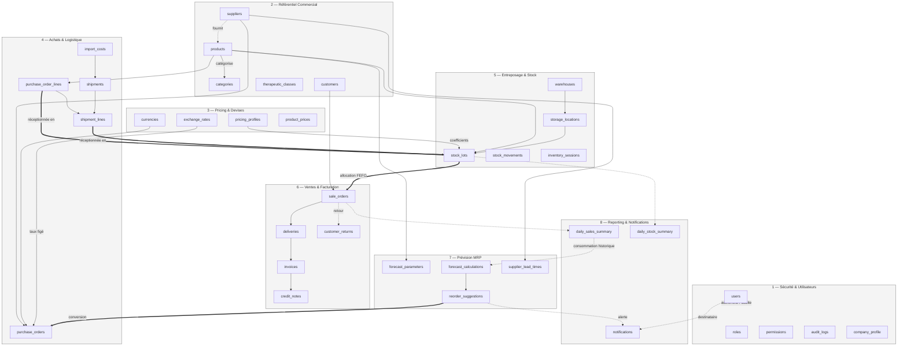

---

## 4. Sections par domaine

### 4.1 Domaine 1 — Sécurité & Utilisateurs

**Rôle métier.** Authentifie les utilisateurs, porte le modèle RBAC (utilisateur → rôle(s) → permissions) qui conditionne l'accès à tous les autres domaines, journalise toute action sensible et conserve le paramétrage réglementaire de l'entreprise (licence de dépositaire). Domaine racine : ne dépend d'aucun autre domaine métier.

| Règle de gestion | Table / colonne | Source |
|---|---|---|
| Le mot de passe n'est jamais stocké en clair | `users.password_hash` | Règle générale de sécurité ; PRD_Qwen-5 §5.9.2 |
| Verrouillage après tentatives échouées répétées | `users.failed_login_attempts`, `users.lockout_end_at` | PRD_Qwen-5 §5.3.4 (5 tentatives, verrouillage 15 min) |
| Un utilisateur peut avoir plusieurs rôles | `user_roles` (association N:N) | PRD_Qwen-5 §5.5.6 US-RBAC-03 ; vérifié dans le scénario (Kokou Amegan = Achats + Direction) |
| RBAC représenté par des tables explicites, jamais un champ texte libre | `roles`, `permissions`, `role_permissions` | PRD_Qwen-5 §5.5.1/§5.5.5 ; règle 2.6 de la mission |
| Dérogation individuelle de permission sans modifier tout un rôle | `user_permission_exceptions` | PRD_Qwen-5 §5.5.5 (entité `UserPermissionException`) |
| Le jeton de renouvellement est révocable et expire | `refresh_tokens.expires_at`, `revoked_at` | PRD_Qwen-5 §5.3.3 |
| Toute action sensible est journalisée (utilisateur, IP, User-Agent, module, résultat) | `audit_logs` | PRD_Qwen-5 §5.8.2/§5.8.3 ; format aligné sur `ILoggerManager` (PRD_CLAUDE §12.5) |
| La cible d'un log d'audit peut être n'importe quelle entité métier | `audit_logs.entity_type` / `entity_id` (référence polymorphe, sans FK stricte, documentée) | Règle 2.5 de la mission |
| La licence de dépositaire a une échéance à surveiller | `company_profile.depositary_license_expires_at` | PRD_CLAUDE §17.1 ("alerte avant échéance, mécanisme similaire à l'alerte de péremption produit") |
| Email unique parmi les comptes actifs, réutilisable après suppression logique | index partiel `ux_users_email … WHERE deleted_at IS NULL` | Convention 2.5 (soft delete + unicité) |

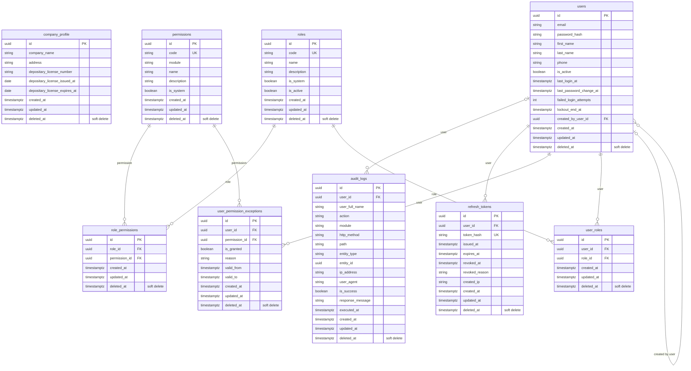

### 4.2 Domaine 2 — Référentiel Commercial

**Rôle métier.** Porte le catalogue produit et les référentiels contrôlés (catégories, classes thérapeutiques, fournisseurs, clients) qui remplacent la saisie libre à l'origine des incohérences observées dans les fichiers Excel actuels (libellés fournisseur variables, doublons de désignation produit). Dépend uniquement du domaine Sécurité (`created_by`).

| Règle de gestion | Table / colonne | Source |
|---|---|---|
| Fiche fournisseur unique, pas de saisie libre du nom | `suppliers.name` (index unique partiel) | PRD_CLAUDE §2.3.1 (constat des doublons « HORIBA » / « HORIBA ABX SAS ») |
| Désignation produit unique parmi les produits actifs | `products.designation` (index unique partiel) | PRD_Qwen module 3 §US-REF-01 ; élimine les 9 doublons exacts constatés en Phase 1 |
| « Forme » = forme pharmaceutique réelle, distincte du conditionnement | `products.pharmaceutical_form` vs `products.dosage`/`carton_quantity` | PRD_CLAUDE §2.3.2 (incohérence Forme/Dosage entre les deux feuilles Excel, vérifiée en Phase 1) |
| La TVA n'est jamais déduite automatiquement de la seule catégorie | `categories.default_vat_rate` (défaut) + `products.vat_rate_override` (surcharge nullable) | PRD_CLAUDE §17.4 ; confirmé empiriquement par l'exception ABX DILUENT 20L (réactif à TVA 18%, Phase 1) |
| Un produit peut avoir plusieurs fournisseurs habituels, avec un fournisseur principal | `product_suppliers` (N:N), `is_primary` | PRD_CLAUDE §8.1.2 |
| Le « répartiteur » n'est pas une entité séparée, c'est un type de client | `customers.customer_type = 'repartiteur'` | PRD_CLAUDE §9.3 (décision documentée, cohérente avec les données réelles qui mélangent pharmacies/cliniques/répartiteurs) |
| Vérification de l'autorisation de distribution avant référencement fournisseur | `suppliers.distribution_authorization_verified` | PRD_CLAUDE §17.5 point 1 (BPD/WHO-GDP) |
| Vérification de la licence client avant livraison | `customers.license_verified` | PRD_CLAUDE §17.5 point 2 |
| Seuil d'alerte de péremption configurable par catégorie | `categories.expiry_alert_days` | PRD_Qwen-2 §2.4.5 (60 à 120 j selon catégorie) |
| Classes thérapeutiques et catégories comme listes contrôlées | `therapeutic_classes`, `categories` | PRD_CLAUDE §8.1.6 |

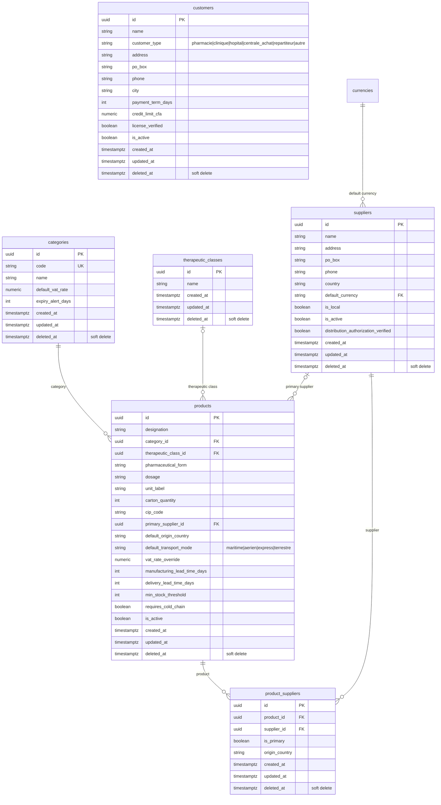

### 4.3 Domaine 3 — Pricing & Devises

**Rôle métier.** Gère les devises et taux de change multi-monnaies, et le moteur de tarification à cascade de coefficients — cœur différenciant de LABMEDIS, vérifié terme à terme sur les 17 produits France Lait de `Structure_de_prix.xlsx`. Dépend du Référentiel Commercial (produits, catégories, fournisseurs).

| Règle de gestion | Table / colonne | Source |
|---|---|---|
| Référentiel des devises de gestion (EUR, USD, XOF), 0 décimale pour le XOF | `currencies.code`, `decimal_places` | PRD_CLAUDE §8.10.1 ; règle 10.3 (pas de centime en XOF) |
| Prix de revient = cascade **multiplicative** de coefficients | `pricing_profiles.commission_coeff / freight_coeff / transit_coeff / transfer_fee_coeff`, appliqués à `stock_lots.unit_cost_cfa` | PRD_Qwen-1 §1.1 ; vérifié à l'identique (3358,82 → 3359 CFA) dans le scénario §8 |
| Coefficients jamais codés en dur, ajustables par la direction sans redéploiement | `pricing_profiles` (table de configuration, pas de constante applicative) | PRD_Qwen-1 §1.2 |
| Le taux EUR/XOF est fixe (655,957), non modifiable sans intervention explicite | `exchange_rates` (rien n'empêche en base une nouvelle ligne EUR/XOF ; le caractère « fixe » est une politique applicative, volontairement non figée en contrainte SQL — règle 2.5 : jamais de contrainte sur une valeur mouvante) | PRD_CLAUDE §10.3 ; vérifié exact (2236,81337 / 3,41 = 655,957) en Phase 1 |
| Le taux appliqué à une commande est figé et non recalculé après coup | `purchase_orders.locked_exchange_rate_id` (domaine 4, FK vers `exchange_rates`) | PRD_Qwen-1 §1.3 ; PRD_CLAUDE §10.3 |
| Historique complet des prix, une seule ligne « courante » par produit | `product_prices` (table append-only, `effective_to IS NULL` = prix courant, index unique partiel) | PRD_CLAUDE §8.6.7 ("historiser toute évolution de prix") |
| L'écart entre prix calculé et prix pratiqué est conservé, jamais écrasé | `product_prices.pv_ht_calculated` vs `pv_ht_applied` | Règle 10.8 (PRD_CLAUDE) ; vérifié (-35 CFA) dans le scénario |
| Le prix de revient stocké est arrondi à l'entier CFA (pas de centime) | `stock_lots.unit_cost_cfa NUMERIC(14,0)`, `product_prices.*_cfa NUMERIC(14,0)` | PRD_Qwen-1 §1.5 (`ToCfaRounded()`, `MidpointRounding.AwayFromZero`) |
| Une simulation de prix n'est pas une décision publiée | `pricing_simulations`, distincte de `product_prices` | PRD_Qwen module 3 §US-PRICE-01 |

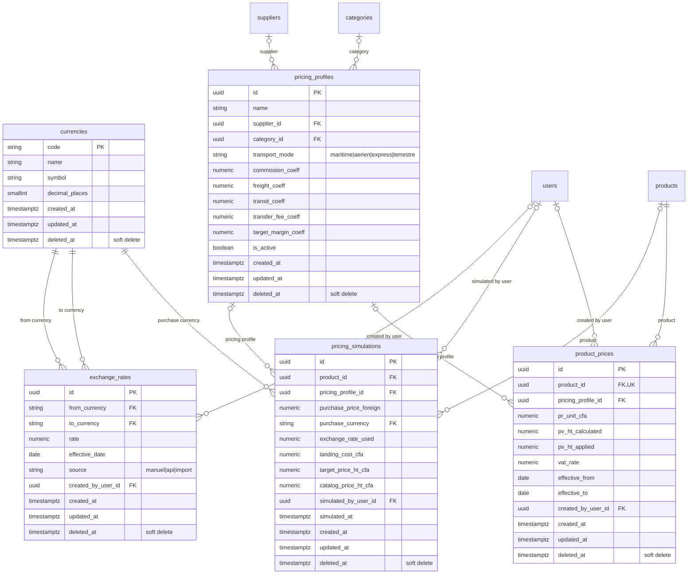

### 4.4 Domaine 4 — Achats & Logistique Internationale

**Rôle métier.** Pilote les commandes fournisseurs multi-devises, le suivi des expéditions (maritime/aérien/express/terrestre) et le transit douanier. C'est le domaine où le **[CONTRADICTION]** entre sources a été résolu (cf. §9.1) : la cardinalité commande↔expédition. Dépend du Référentiel Commercial et de Pricing & Devises.

| Règle de gestion | Table / colonne | Source |
|---|---|---|
| Le taux de change est figé à la validation de la commande | `purchase_orders.locked_exchange_rate_id` | PRD_Qwen-1 §1.3 |
| Circuit de validation par seuil de montant (au-delà, validation Direction obligatoire) | `purchase_orders.status = 'en_attente_validation'` (statut intermédiaire), seuil laissé en configuration applicative (pas de montant figé en SQL, cf. règle 2.5) | PRD_CLAUDE §20.2 |
| Une commande peut être expédiée en plusieurs fois **et** une expédition peut consolider plusieurs commandes | `shipment_lines.purchase_order_line_id` (jamais de FK directe `shipments → purchase_orders`) | **[CONTRADICTION]** PRD_CLAUDE §9.1/§8.3.3 (N:1) vs PRD_Qwen module 3 §3.5.4 (N:N) — résolu en N:N au niveau ligne, cf. §9.1 |
| Le régime douanier est un référentiel contrôlé (OTR) | `shipments.customs_regime` | PRD_CLAUDE §17.3 (liste des 11 régimes OTR) |
| Une autorisation d'importation DPML peut être associée à l'expédition | `shipments.import_authorization_number/date` | PRD_CLAUDE §17.2 |
| Les frais logistiques réels sont alloués par expédition, méthode configurable | `import_costs.allocation_method` (valeur/quantité/volume) | PRD_Qwen module 3 §US-LOG-02 ; **registre comptable, n'alimente pas le PRU du lot** — cf. [CONTRADICTION] pricing §9.1 |
| Chaque changement de statut de commande est horodaté et consultable | `purchase_order_status_history` | PRD_Qwen module 3 §US-ACH-03 ; vérifié dans le scénario (4 statuts historisés pour PO-2026-000456) |
| Le mode de transport influence le calcul du prix de revient | `stock_lots.transport_mode`, cohérent avec `pricing_profiles.transport_mode` | PRD_Qwen-1 §1.2 ; PRD_brut.md (transcript audio d'origine) |
| Timeline des événements de transport | `shipment_events` | PRD_Qwen module 3 §US-LOG-03 ; vérifié (4 événements pour EXP-2026-000789) |

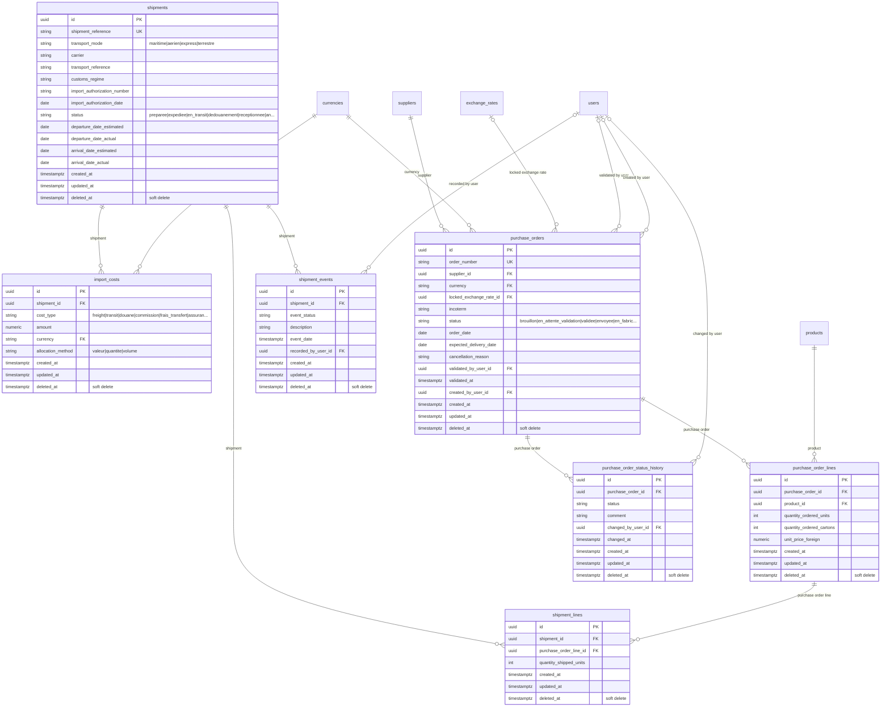

### 4.5 Domaine 5 — Entreposage & Stock

**Rôle métier.** Cœur de la conformité pharmaceutique : traçabilité par lot, adressage physique hiérarchique, mouvements de stock, inventaires. Porte les statuts qualité (quarantaine, libération, péremption) et la règle FEFO. Dépend du Référentiel Commercial et des Achats (origine des lots).

| Règle de gestion | Table / colonne | Source |
|---|---|---|
| Un lot est l'unité de traçabilité de base | `stock_lots` | PRD_brut.md ; PRD_CLAUDE §4 point 3 |
| Numéro de lot unique par couple fournisseur/produit | index unique partiel `ux_stock_lots_supplier_product_batch` | PRD_CLAUDE règle 10.1 |
| Quantité reçue indépendante du conditionnement standard (un carton peut varier d'un lot à l'autre) | `stock_lots.initial_quantity` (unités réelles) + `carton_quantity_received` (cartons réellement comptés) | PRD_brut.md (« si un carton a 40 produits, on enregistre 40 produits, mais on garde aussi que c'est venu dans des cartons ») ; règle 10.2 |
| Statut « en attente de libération » — un dépositaire stocke des lots non encore libérés par le fabricant, mais ne peut les distribuer avant libération formelle | `stock_lots.status = 'en_attente_liberation'` | PRD_CLAUDE §17.5 point 6 (BPD/WHO-GDP) — **absent de l'énumération initiale de PRD_Qwen-2 §2.13.2**, ajouté ici suite à la recherche réglementaire |
| Seuls les lots libérés peuvent être proposés à la vente | `stock_lots.status = 'libere'` filtré par l'index `ix_stock_lots_product_fefo` | PRD_Qwen-2 §2.4.6 ; vérifié par `EXPLAIN` en §8 |
| Un même lot peut être stocké à plusieurs emplacements | `stock_lot_locations` (N:N produit-emplacement, avec quantité réservée) | PRD_Qwen-2 §2.3.3 |
| Emplacement hiérarchique (zone/allée/rack/niveau) | `storage_locations.parent_location_id` (auto-référence) | PRD_Qwen-2 §2.3.3/§2.5.1 ; vérifié dans le scénario (ZONE-A → A-01-02-01) |
| Zone de quarantaine et zone de périmés obligatoires | `storage_locations.location_type IN ('quarantaine','perimes',...)` | PRD_Qwen-2 §2.5.3 |
| FEFO par défaut, dérogation manuelle tracée | `sale_order_lines.is_fefo_override` (domaine 6) s'appuie sur `stock_lots.expiry_date` | Règle 10.5 |
| Stock disponible = physique − réservé − quarantaine − périmé | `stock_lot_locations.quantity - reserved_quantity`, filtré par `stock_lots.status` | PRD_Qwen-2 §2.4.3 ; vérifié (cohérence stock §8) |
| Toute entrée/sortie est tracée (utilisateur, date, motif, référence source) | `stock_movements` + `stock_movement_lines`, référence polymorphe `source_document_type/id` | PRD_Qwen-2 §2.4.1/§2.4.2/§2.6.2 ; règle 2.5 (référence polymorphe documentée) |
| Écart d'inventaire jamais figé en contrainte SQL (calculé en couche service) | `inventory_counts.system_quantity` / `counted_quantity` (deux colonnes brutes, pas de colonne générée) | Règle 2.5 |

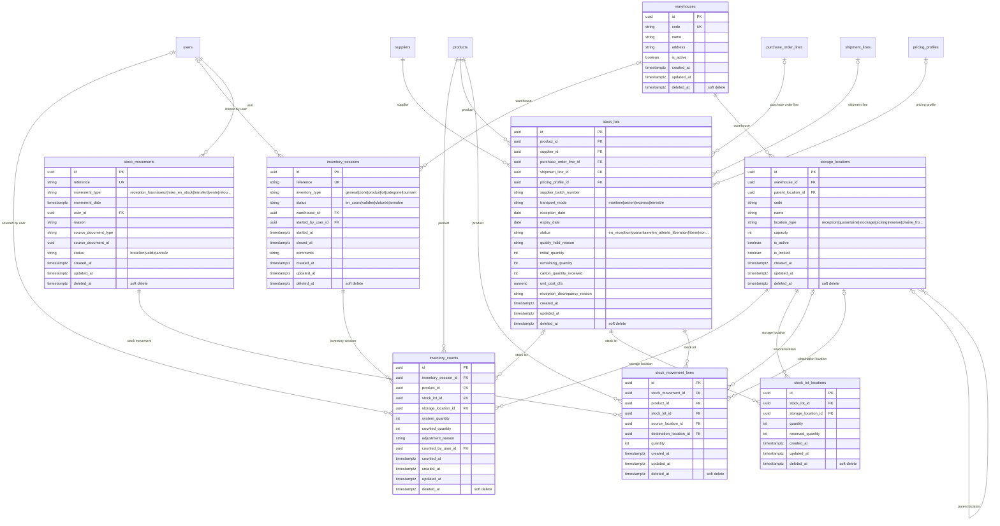

### 4.6 Domaine 6 — Ventes & Facturation

**Rôle métier.** Couvre l'intégralité du flux commercial : commande client avec allocation FEFO, livraison, facturation, retours et avoirs. Regroupe volontairement Ventes et Facturation dans un seul domaine (11 tables, à la limite haute de la fourchette 5-12) : dans les sources, ces deux sous-processus s'enchaînent comme un seul flux séquentiel (PRD_Qwen module 3, workflows 7/9/10/11), pas comme deux domaines indépendants. Dépend du Référentiel Commercial, de l'Entreposage & Stock (lots) et de Pricing & Devises (devises).

| Règle de gestion | Table / colonne | Source |
|---|---|---|
| Un client peut avoir un tarif négocié, prioritaire sur le catalogue | `customer_product_prices`, fenêtre de validité | PRD_Qwen module 3 §US-VEN-05 |
| Le stock est réservé à la confirmation, sans décrémenter le stock physique avant sortie réelle | `stock_lot_locations.reserved_quantity` (mis à jour par le service applicatif à la confirmation de `sale_orders`) | PRD_Qwen-2 §2.9.1 ; PRD_Qwen module 3 §US-VEN-04 |
| Le lot alloué et son prix/TVA sont figés à la vente | `sale_order_lines.allocated_stock_lot_id`, `unit_price_ht_cfa`, `vat_rate` | Règle 2.5 (figé en instantané) |
| Toute dérogation à l'allocation FEFO est tracée avec motif | `sale_order_lines.is_fefo_override`, `fefo_override_reason` | PRD_Qwen-2 §2.4.4 (option alternative, motif obligatoire) |
| Une commande peut être livrée en plusieurs fois | `deliveries` (1:N depuis `sale_orders`) | PRD_Qwen module 3 §3.11.3 |
| Le n° de lot figure en pied de facture (traçabilité légale) | `invoice_lines.stock_lot_id` | PRD_CLAUDE §18.2 (gabarit facture/BL) |
| Numérotation de facture unique | index unique partiel `ux_invoices_number` | PRD_Qwen module 3 §3.12.3 |
| Un retour référence toujours la vente et le lot d'origine | `customer_returns.sale_order_line_id` (RESTRICT), `original_stock_lot_id` | PRD_CLAUDE §20.3.1 |
| Un retour a une décision explicite parmi 4 issues | `customer_returns.decision IN ('remise_stock','quarantaine','destruction','refus')` | PRD_Qwen module 3 §3.13.3 ; PRD_CLAUDE §20.3.2 |
| Un retour accepté génère un avoir | `customer_returns.credit_note_id` → `credit_notes` | PRD_CLAUDE §20.3.2 ; vérifié dans le scénario (RET-2026-000015 → AV-2026-000031) |
| Aucun chevauchement de tarif négocié pour un même couple client/produit | contrôle applicatif sur `customer_product_prices` (requête de détection en §8, exécutée et vérifiée) | Cohérence métier ; pas une contrainte `EXCLUDE` PostgreSQL ici (préféré en couche service pour permettre un message d'erreur métier clair) |

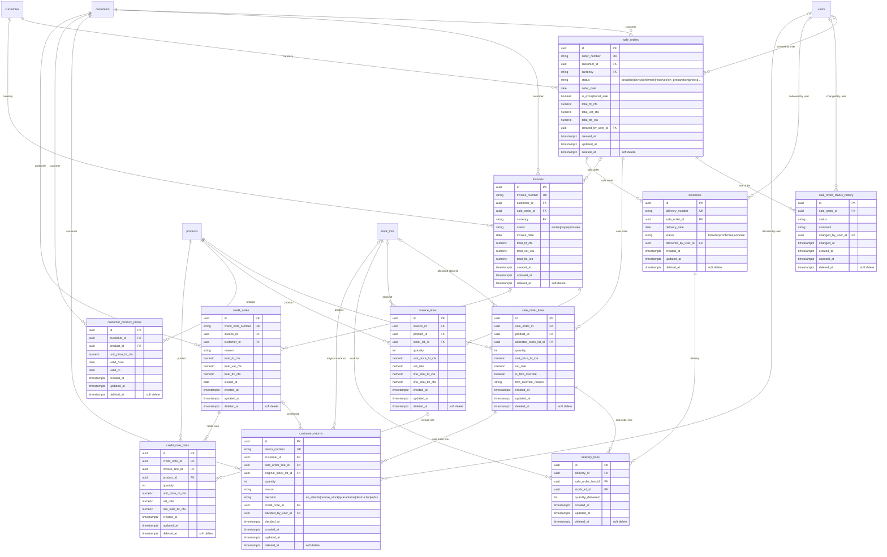

### 4.7 Domaine 7 — Prévision & Réapprovisionnement (MRP)

**Rôle métier.** Anticipe les ruptures de stock à partir des délais de fabrication/transport/transit et de la consommation historique, puis déclenche des suggestions de commande. Domaine intentionnellement compact (4 tables, en dessous de la fourchette indicative 5-12) : chacune correspond exactement à une entité déjà définie et exécutable dans PRD_Qwen-4 §4.16.1, sans table ajoutée par convenance pour atteindre un chiffre. Dépend du Référentiel Commercial et des Achats.

| Règle de gestion | Table / colonne | Source |
|---|---|---|
| Le MRP est activable/désactivable par produit | `forecast_parameters.is_enabled` | PRD_Qwen-4 §4.16.1 |
| Lead time total = fabrication + préparation + transport + douane + interne | `supplier_lead_times.manufacturing_lead_time_days + preparation_lead_time_days + transport_lead_time_days + customs_lead_time_days + internal_lead_time_days` | PRD_Qwen-4 §4.3.3 ; formule reproduite et vérifiée dans le scénario (110 j) |
| Délais surchargeables par produit et par mode de transport | `supplier_lead_times.product_id` (nullable), `transport_mode` | PRD_Qwen-4 §4.7.1/§4.7.2 |
| Point de commande = conso. moyenne × lead time + stock de sécurité | `forecast_calculations.reorder_point` | PRD_Qwen-4 §4.4.2 ; vérifié (2500) |
| Chaque calcul MRP est un instantané daté, servant aussi d'historique | `forecast_calculations` (append-only, `calculation_date`) | PRD_Qwen-4 §4.16.1 (`ForecastCalculation`) |
| Une suggestion est convertible en commande fournisseur, ou rejetable avec motif | `reorder_suggestions.status`, `purchase_order_id`, `rejection_reason` | PRD_Qwen-4 §4.13/§US-MRP-08/09 ; vérifié dans le scénario (suggestion urgente générée, produit sous couverture) |
| La consommation historique n'est pas dupliquée : lue depuis le domaine Reporting | pas de table dédiée — `forecast_calculations.average_daily_consumption` est calculé à partir de `daily_sales_summary` (domaine 8) | Décision d'arbitrage — évite une double source de vérité entre ce domaine et le domaine Reporting |
| Un coefficient de saisonnalité unique par produit (pas de courbe mensuelle) | `forecast_parameters.seasonality_factor` | PRD_Qwen-4 §4.16.1 (entité C# de référence, plus stricte que la prose §4.11 qui évoque des « périodes ») — simplification documentée, cf. §10 recommandations V2 |

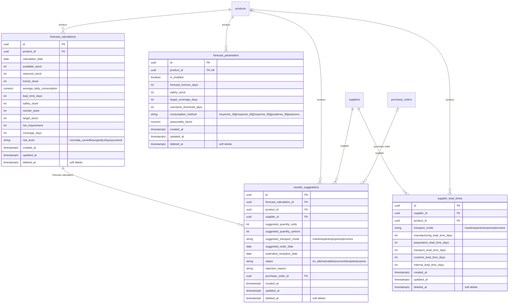

### 4.8 Domaine 8 — Reporting, Agrégations & Notifications

**Rôle métier.** Fournit des tables d'agrégation pré-calculées pour les tableaux de bord (évite de scanner tout le grand livre des ventes/stock à chaque affichage) et persiste les notifications temps réel pour qu'elles restent consultables hors connexion. Dépend du Référentiel Commercial et de la Sécurité (destinataire).

| Règle de gestion | Table / colonne | Source |
|---|---|---|
| Synthèse quotidienne des ventes par client/produit/catégorie | `daily_sales_summary` | PRD_Qwen-6 §6.24.1 (`DailySalesSummary`) ; alimente aussi la consommation MRP (domaine 7) |
| Synthèse quotidienne du stock (physique/réservé/disponible/quarantaine/périmé/valorisé) | `daily_stock_summary` | PRD_Qwen-6 §6.24.1 (`DailyStockSummary`) |
| Synthèse quotidienne du risque de rupture, distincte du détail de calcul | `daily_forecast_summary` | PRD_Qwen-6 §6.24.1 (`DailyForecastSummary`) — vue dashboard condensée, le détail complet reste dans `forecast_calculations` (domaine 7) |
| Synthèse financière mensuelle (CA, TVA, coût des ventes, marge, achats, logistique) | `monthly_financial_summary` | PRD_Qwen-6 §6.24.1 (`MonthlyFinancialSummary`) |
| Une notification temps réel doit rester retrouvable hors ligne | `notifications.is_read`, persistée en base (pas uniquement poussée via SignalR) | PRD_Qwen-5 §5.19.3 |
| Une notification peut cibler un utilisateur ou un rôle entier | `notifications.recipient_user_id` / `recipient_role_id` (au moins l'un des deux, contrôle applicatif) | PRD_Qwen-5 §5.27.1 (notifications filtrées par rôle) ; vérifié dans le scénario (alerte ReorderSuggestionCreated → rôle Achats) |
| La source d'une notification peut être n'importe quelle entité métier | `notifications.source_document_type/id` (référence polymorphe, sans FK stricte) | Règle 2.5 |

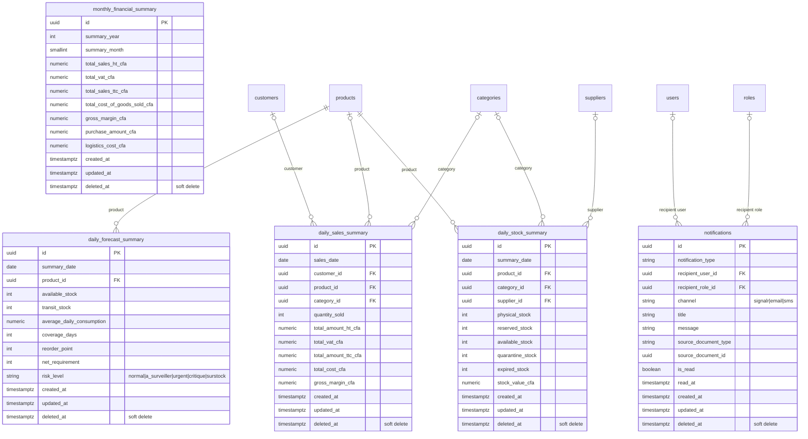

---

## 5. Flux critiques — diagrammes de séquence

Quatre flux ont été retenus parmi les processus les plus complexes ou les plus sensibles du système (fourchette 2-5 demandée) : le calcul du prix de revient à la réception (cascade de coefficients), l'allocation FEFO jusqu'à la facturation, la boucle de réapprovisionnement automatique (MRP), et l'authentification avec vérification RBAC en direct — ce dernier flux étant explicitement cité en exemple de « flux critique » par la mission. Les 4 fichiers sont validés par le parseur Mermaid (`type=sequence`).

### 5.1 Réception de conteneur → création de lots avec PRU

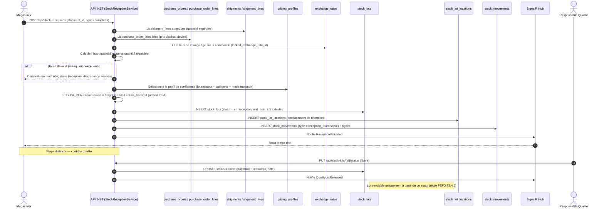

### 5.2 Commande client → allocation FEFO → livraison → facturation

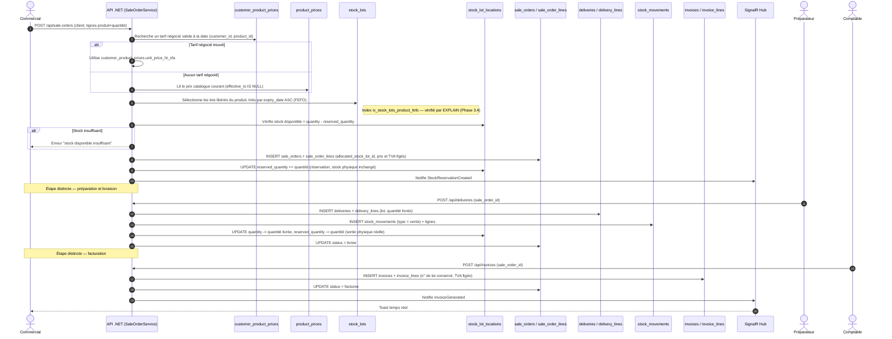

### 5.3 Alerte de réapprovisionnement (job MRP quotidien) → suggestion → conversion en commande

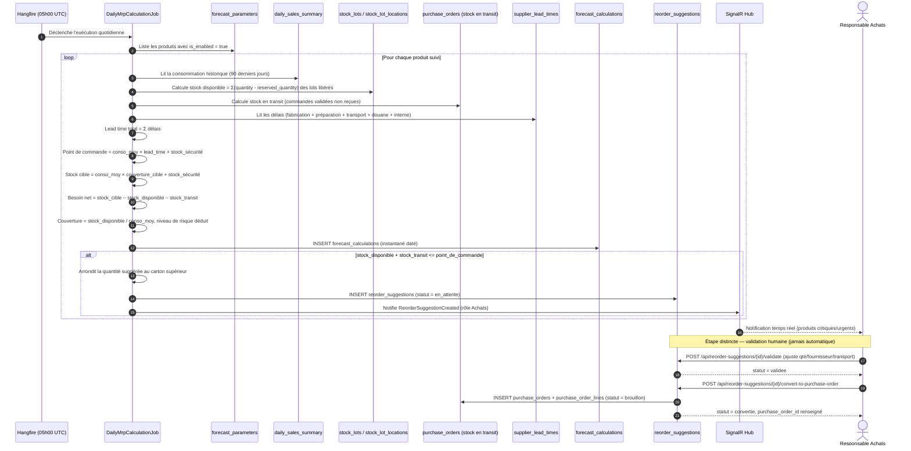

### 5.4 Authentification et vérification RBAC en direct

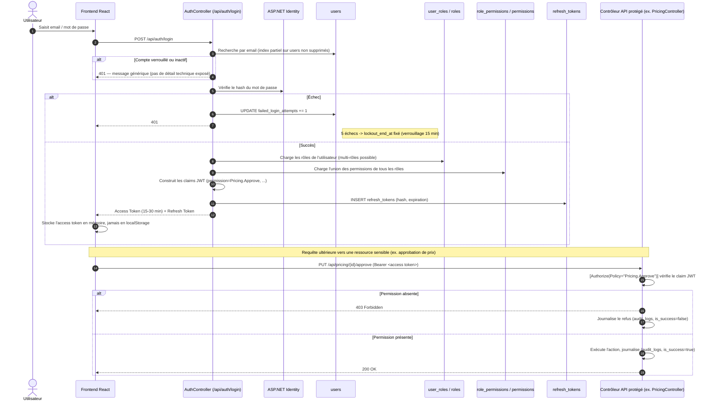

---

## 6. Intégration avec un système externe

**Constat de la Phase 1 (à assumer explicitement, pas à masquer) : aucune des intégrations listées par les sources ne constitue un système externe détenant son propre référentiel métier à synchroniser en base.** PRD_Qwen-5 §5.13 énumère les intégrations techniques prévues : ASP.NET Identity (interne), SignalR (interne), Hangfire (interne), FluentEmail/SMTP, Twilio SMS, DinkToPdf, une API de taux de change, un lecteur de codes-barres/QR, un export comptable optionnel. Aucune n'a de schéma de données propre qu'il faudrait « ponter » (pattern Bridge) avec le modèle métier — ce ne sont pas des systèmes de vérité concurrents (pas de CRM, pas d'ERP tiers, pas de passerelle de paiement gérant ses propres identifiants).

Le seul cas limite est le **taux de change**, dont l'origine peut être externe (API de la BCEAO ou équivalent) :

| Donnée | Répliquée en base ? | Interrogée à la demande ? | Fraîcheur |
|---|---|---|---|
| Taux de change EUR/XOF, USD/XOF | Répliquée (`exchange_rates`, historisée) | Non — le taux utilisé pour une transaction est toujours celui figé en base au moment de la validation, jamais relu en direct après coup (traçabilité financière, PRD_Qwen-1 §1.3) | `exchange_rates.source` documente la provenance (`manuel` / `api` / `import`) sans modéliser de pont de table dédié — un simple champ suffit car la donnée n'a pas de structure propre à synchroniser, juste une valeur et une date |
| Export comptable optionnel (PRD_Qwen-5 §5.21) | Non répliqué : export en sortie uniquement (CSV/Excel), jamais de lecture retour | Sans objet — flux à sens unique | Hors périmètre v1 (PRD_CLAUDE §5.2 point 1) |

**Décision sensible non concernée ici** — la règle générale (« une décision sensible relit toujours le système externe en direct, jamais un cache ») ne s'applique à aucune donnée de ce modèle : le taux de change n'est *jamais* relu en direct pour une transaction déjà validée, précisément parce que la traçabilité financière exige l'inverse (figer, ne jamais recalculer rétroactivement — PRD_CLAUDE règle 10.3). Ce n'est pas une exception à la règle de fraîcheur : c'est que la donnée « sensible » ici est le taux *historisé*, pas un système tiers à consulter en direct.

Si LABMEDIS adopte plus tard une intégration douanière/transitaire de niveau 3 ou 4 (API transitaire, PRD_CLAUDE §17.2/§5.22.3), ce serait alors un candidat réel au pattern Bridge : une table `customs_broker_references` porterait l'identifiant externe (numéro de dossier transitaire) en référence sur `shipments`, sans jamais fusionner le schéma du transitaire avec `shipments`. Non implémenté ici car explicitement hors périmètre v1 (PRD_CLAUDE §16.1 point « niveau 1 : saisie manuelle » retenu pour la v1).

---

## 7. Sécurité & gouvernance des données

### 7.1 Données à caractère personnel (PII) par table

| Table | Colonnes PII | Nature | Traitement |
|---|---|---|---|
| `users` | `email`, `first_name`, `last_name`, `phone` | Identité du personnel LABMEDIS | Email indexé unique (partiel), jamais exposé en clair dans les logs ; `password_hash` jamais en clair (règle absolue, cf. §7.3) |
| `audit_logs` | `user_full_name`, `ip_address`, `user_agent` | Données de connexion/traçabilité | Conservation minimale 1 an (PRD_Qwen-5 §5.12.2), accès restreint (§7.4) |
| `refresh_tokens` | `created_ip` | Adresse IP | `token_hash` jamais en clair ; purge recommandée à l'expiration (job Hangfire, hors périmètre DDL) |
| `customers` / `suppliers` | `address`, `phone`, `po_box` | Coordonnées d'entités commerciales (personnes morales, pas des particuliers au sens strict — pharmacies, cliniques, hôpitaux, fournisseurs) | Sensibilité commerciale « Haute » (PRD_Qwen-5 §5.9.1), pas un traitement RGPD de données de particuliers |
| `notifications` | aucune donnée personnelle propre au-delà de `recipient_user_id` (déjà couvert par `users`) | — | — |

Aucune colonne de mot de passe, jeton ou secret n'est stockée en clair nulle part dans le modèle (vérifié par relecture exhaustive des 636 colonnes : seules `password_hash` et `token_hash` portent une donnée d'authentification, toutes deux nommées explicitement pour lever toute ambiguïté sur leur nature de hash).

### 7.2 Données financières sensibles (classification PRD_Qwen-5 §5.9.1)

| Sensibilité | Données | Tables | Masquage prévu |
|---|---|---|---|
| Haute | Prix d'achat, prix de revient, marge | `purchase_order_lines.unit_price_foreign`, `product_prices.pr_unit_cfa`, `stock_lots.unit_cost_cfa` | Accès conditionné à la permission `Pricing.Read` côté API (§7.4) ; le frontend ne doit pas recevoir ces champs si la permission est absente (masquage double : backend ET frontend, PRD_Qwen-5 §5.9.3) |
| Haute | Prix client spécifique | `customer_product_prices.unit_price_ht_cfa` | Idem |
| Haute | Listes clients / fournisseurs | `customers`, `suppliers` | Lecture large (quasi tous les rôles), écriture restreinte |
| Haute | Factures, avoirs | `invoices`, `credit_notes` | Accès Comptable/Direction/Admin (matrice §7.4) |

### 7.3 Secrets — jamais en base, jamais en clair

Conformément à l'interdiction absolue de la mission : aucun mot de passe, token ou secret n'est stocké en clair. Ce modèle ne contient **aucune** colonne de configuration technique (chaînes de connexion, clés API SMTP/Twilio/taux de change, clé JWT) — ces éléments relèvent d'un gestionnaire de secrets ou de variables d'environnement (PRD_Qwen-5 §5.24), hors du périmètre d'un modèle de données métier. Seules deux colonnes portent une donnée d'authentification, et toutes deux sous forme de hash : `users.password_hash`, `refresh_tokens.token_hash`.

### 7.4 Couverture RBAC

Le modèle ne code en dur aucun rôle ni aucune permission : `roles` et `permissions` sont des données, pas des types. La liste de 10 rôles recommandée par PRD_Qwen-5 §5.5.2 (Admin, Direction, Achats, Logistique, Magasinier, Qualité, Commercial, Comptable, Préparateur, Lecture seule) — réconciliée avec les 6 rôles plus généraux de PRD_CLAUDE §6 — se peuple par insertion de lignes, comme vérifié dans le scénario §8 (7 rôles, 5 permissions, 1 utilisateur multi-rôles). La matrice de permissions détaillée de PRD_Qwen-5 §5.5.4 (39 lignes fonctionnelles × 8 rôles) devient des lignes `role_permissions`, pas une matrice figée dans le schéma — elle reste éditable par un administrateur sans migration.

Trois niveaux de contrôle d'accès coexistent, du plus large au plus fin :
1. **Rôle → permissions** (`role_permissions`) : la politique par défaut.
2. **Dérogation individuelle** (`user_permission_exceptions`) : accorde ou retire une permission précise à un utilisateur nommé, avec motif et fenêtre de validité, sans toucher au rôle.
3. **Journalisation de chaque vérification** (`audit_logs`, `is_success=false` sur un refus) : un refus de permission est lui-même un événement audité (PRD_Qwen-5 §5.5.6 US-RBAC-04).

### 7.5 Politique de rétention et suppression

| Donnée | Durée recommandée | Mécanisme |
|---|---|---|
| Mouvements de stock | Minimum 5 ans | Soft delete uniquement — `stock_movements.deleted_at`, jamais de suppression physique |
| Factures, avoirs | Selon obligation fiscale togolaise | Soft delete uniquement |
| Logs de sécurité (`audit_logs`) | Minimum 1 an | Soft delete ; purge physique hors périmètre DDL (job d'archivage applicatif) |
| Lots pharmaceutiques | Durée de vie produit + marge de sécurité | Jamais de suppression physique — traçabilité de rappel de lot (§5.12.4 PRD_Qwen-5) exige l'historique complet |
| Notifications anciennes | Politique applicative (purge recommandée, PRD_Qwen-5 §5.20.1) | Suppression physique acceptable ici *seule exception* : une notification lue et ancienne n'a pas la valeur probatoire d'un mouvement de stock ou d'une facture — à confirmer avec LABMEDIS |

Aucune donnée métier n'est supprimée physiquement dans ce modèle, à la seule exception documentée des notifications anciennes (recommandation, pas une implémentation figée en base).

---

## 8. Requêtes clés (réellement exécutées, Phase 3.4)

Toutes les requêtes ci-dessous ont été exécutées contre la base construite depuis `schema.sql`, avec le scénario métier de bout en bout inséré (cf. `scripts/scenario.sql`, fourni comme fichier annexe). Les deux requêtes sensibles à la performance ont en outre été testées contre un volume synthétique de **12 400 lots** (400 produits × 30 lots), car une table quasi vide aurait rendu tout `EXPLAIN` non représentatif.

### 8.1 Allocation FEFO (chemin le plus chaud du système — exécuté à chaque ligne de vente)

```sql
SELECT id, supplier_batch_number, expiry_date, remaining_quantity
FROM stock_lots
WHERE product_id = :product_id AND status = 'libere' AND deleted_at IS NULL
ORDER BY expiry_date ASC LIMIT 20;
```
**Index dédié :** `ix_stock_lots_product_fefo` (partiel, `WHERE deleted_at IS NULL AND status = 'libere'`).
**Preuve d'exécution (`EXPLAIN ANALYZE, BUFFERS`) :** `Bitmap Index Scan on ix_stock_lots_product_fefo`, 19 lignes retournées, **0,109 ms**. Confirme que l'index partiel est effectivement sélectionné par le planificateur sur un volume réaliste.
**Table à surveiller si le volume grossit :** `stock_lots` — l'index reste efficace tant que la sélectivité par `product_id` reste bonne ; si un même produit accumule des dizaines de milliers de lots actifs (cas non réaliste pour LABMEDIS), un partitionnement par date de réception serait à envisager.

### 8.2 Lots proches de péremption à 90 jours (tableau de bord Qualité/Stock)

```sql
SELECT p.designation, sl.supplier_batch_number, sl.expiry_date, sl.remaining_quantity
FROM stock_lots sl JOIN products p ON p.id = sl.product_id
WHERE sl.status = 'libere' AND sl.deleted_at IS NULL
  AND sl.expiry_date <= CURRENT_DATE + INTERVAL '90 days'
ORDER BY sl.expiry_date ASC LIMIT 50;
```
**Index dédié :** `ix_stock_lots_expiry`. **Preuve :** `Index Scan using ix_stock_lots_expiry`, **0,427 ms** sur 12 400 lots.
**Table à surveiller :** `stock_lots` (même table ; les deux index partiels/simples coexistent sans conflit, PostgreSQL choisit celui qui correspond au filtre de la requête).

### 8.3 Tableau de bord stock — valeur et répartition par catégorie

```sql
SELECT cat.name,
       count(*) FILTER (WHERE sl.status='libere') AS lots_disponibles,
       sum(sl.remaining_quantity * sl.unit_cost_cfa) FILTER (WHERE sl.status='libere') AS valeur_stock_cfa
FROM stock_lots sl JOIN products p ON p.id=sl.product_id JOIN categories cat ON cat.id=p.category_id
WHERE sl.deleted_at IS NULL GROUP BY cat.name ORDER BY valeur_stock_cfa DESC NULLS LAST;
```
Résultat vérifié sur le volume de test : 7 141 lots disponibles, valeur totale 5 031 230 178 CFA pour la catégorie Produit infantile — cohérent avec `count(*) × prix unitaire moyen` généré.

### 8.4 Détection de chevauchement de tarifs négociés client (contrôle d'intégrité applicatif)

```sql
SELECT a.id, b.id
FROM customer_product_prices a JOIN customer_product_prices b
  ON a.customer_id=b.customer_id AND a.product_id=b.product_id AND a.id<b.id
WHERE a.deleted_at IS NULL AND b.deleted_at IS NULL
  AND daterange(a.valid_from, COALESCE(a.valid_to,'infinity'),'[]')
   && daterange(b.valid_from, COALESCE(b.valid_to,'infinity'),'[]');
```
**Testé positivement** : deux tarifs volontairement chevauchants insérés (2026-01-01/2026-12-31 et 2026-06-01/2027-06-30 pour le même couple client/produit) sont correctement détectés. Cette requête sert de garde-fou applicatif avant l'activation d'un nouveau tarif — volontairement **pas** une contrainte `EXCLUDE` PostgreSQL, pour permettre un message d'erreur métier explicite côté service plutôt qu'une erreur SQL brute.

### 8.5 Produits à risque de rupture (dashboard MRP, jointure multi-domaines)

```sql
SELECT p.designation, fc.available_stock, fc.coverage_days, fc.risk_level, fc.net_requirement
FROM forecast_calculations fc JOIN products p ON p.id=fc.product_id
WHERE fc.risk_level IN ('urgent','critique')
  AND fc.calculation_date = (SELECT max(calculation_date) FROM forecast_calculations fc2 WHERE fc2.product_id=fc.product_id)
ORDER BY fc.coverage_days ASC;
```
Résultat vérifié : France Lait 1er âge 400g remonté en risque `urgent` (couverture 90 j < lead time 110 j), avec `net_requirement = 900` — valeurs identiques à celles calculées manuellement dans le scénario (§1.3 point 2 du présent document).
**Table à surveiller :** `forecast_calculations` croît d'une ligne par produit suivi et par jour (append-only) — recommandation V2 : partitionner par mois ou purger au-delà de 12 mois glissants (§10).

---

## 9. Décisions d'arbitrage

### 9.1 Contradictions réelles entre documents sources

**[CONTRADICTION 1 — cardinalité commande d'achat ↔ expédition]**
`PRD_CLAUDE.md` §9.1 (ERD), §9.2 point 5, §7.2 point 3 et §8.3.3 modélise `Expedition` avec une commande d'achat unique (`COMMANDE_ACHAT ||--o{ EXPEDITION` : une expédition appartient à une seule commande, une commande peut produire plusieurs expéditions). `PRD_Qwen` module 3 §3.5.3 (entité `Shipment`), §3.5.4 (« une expédition peut couvrir plusieurs commandes | utile si plusieurs commandes sont regroupées dans un conteneur ») et §3.5.5 (US-LOG-01, critère 1 : « l'expédition peut être liée à une ou plusieurs commandes fournisseurs ») exigent explicitement une relation N:N.
**Décision retenue :** modèle N:N résolu au niveau ligne — `shipment_lines` référence `purchase_order_lines` (jamais l'entête de commande). Une expédition n'a donc pas de `purchase_order_id` direct. Ce choix satisfait les deux exigences (commande livrée en plusieurs expéditions **et** expédition consolidant plusieurs commandes) sans jamais bloquer la livraison. **À confirmer avec LABMEDIS.**

**[CONTRADICTION 2 — mécanisme de calcul du prix de revient]**
`PRD_Qwen-1` §1.1 (et `Structure_de_prix.xlsx`, vérifié empiriquement terme à terme en Phase 1) calcule le prix de revient via une cascade **multiplicative** de coefficients : `PR = PA_CFA × commission × freight × transit × frais_transfert`. `PRD_Qwen` module 3 §3.5.3/§3.5.4 et §US-LOG-02 décrit au contraire les frais logistiques comme des **montants additifs** (freight, transit, douane, commission, assurance, manutention) alloués au prorata (valeur/quantité/volume) sur les lignes d'expédition — un second mécanisme de calcul structurellement différent.
**Décision retenue :** le modèle multiplicatif (`pricing_profiles`) reste la méthode **autoritaire** pour `stock_lots.unit_cost_cfa`, car c'est la seule vérifiée sur données réelles et explicitement documentée comme reproductible à tout le catalogue (PRD_CLAUDE §19.1). La table `import_costs` (montants additifs) est conservée comme registre comptable des frais réellement facturés par expédition — utile au rapprochement comptable et à l'analyse de rentabilité par conteneur (PRD_Qwen-6 §6.22.1) — mais n'alimente pas le calcul du PRU du lot. **À confirmer avec LABMEDIS**, notamment si les deux mécanismes doivent un jour converger (écart entre coût théorique et coût réellement facturé à analyser).

### 9.2 Ambiguïtés tranchées (pas des contradictions — sources simplement silencieuses ou imprécises)

| Point | Sources en tension | Décision |
|---|---|---|
| Multi-entrepôt | PRD_Qwen-2 §2.19 le liste en question ouverte ; PRD_Qwen.md mentionne des « transferts inter-dépôts » ; PRD_CLAUDE §9.2 définit `Entrepot` séparément de `EmplacementStockage` | `warehouses` modélisé en entité de premier niveau — coût de modélisation faible, ne bloque pas le mono-entrepôt actuel, n'interdit pas un futur multi-dépôt |
| Statut de lot « en attente de libération » | Absent de l'énumération `LotStatus` de PRD_Qwen-2 §2.13.2 | Ajouté suite à la recherche réglementaire BPD/WHO-GDP de PRD_CLAUDE §17.5 point 6 — enrichissement, pas un désaccord |
| TVA par défaut vs surcharge produit | PRD_Qwen-1 parle de « taux par défaut » ; PRD_Qwen.md §3.3.5/§8.6.6 et PRD_CLAUDE §17.4 exigent tous deux un override produit | Une fois les trois sources lues en entier, elles s'accordent : `categories.default_vat_rate` + `products.vat_rate_override` nullable |
| Placement du tarif client négocié | Pourrait relever de Pricing (mode de transport/fournisseur) ou de Ventes (client) | Rattaché au domaine Ventes — donnée structurellement client-centrique (US-VEN-05) |
| Réconciliation RBAC 6 rôles (PRD_CLAUDE §6) vs 10 rôles (PRD_Qwen-5 §5.5.2) | Les 6 rôles de PRD_CLAUDE sont un sous-ensemble plus général | Modèle data-driven (`roles` = table, pas un type figé) : accueille indifféremment 6, 10, ou toute autre granularité sans migration |
| Numérotation des désignations dupliquées dans le catalogue source | 9 doublons exacts constatés (Phase 1) alors que la désignation doit être unique (US-REF-01) | Contrainte d'unicité imposée au niveau du modèle cible ; la déduplication du référentiel importé est une étape d'import, pas un assouplissement de la règle |

### 9.3 Autres décisions structurantes

1. **Nommage des tables/colonnes en anglais** (`purchase_orders`, `stock_lots`...) malgré une documentation rédigée en français. Les entités C# de référence dans les PRD Qwen sont déjà nommées en anglais (`PurchaseOrder`, `StockLot`...) ; conserver ce vocabulaire évite une couche de traduction supplémentaire entre le modèle de données et le code EF Core, tout en respectant la convention `snake_case` imposée par la mission.
2. **Séparation Livraison / Facturation** (au lieu d'une fusion `CommandeVente → Facture` comme dans le brouillon PRD_CLAUDE §9) : justifiée par PRD_CLAUDE §8.8.3/§18.2 lui-même et par PRD_Qwen module 3 qui consacre deux workflows distincts (9 et 10).
3. **Pas de contrainte `EXCLUDE` PostgreSQL** pour les chevauchements de tarifs négociés ou de réservations : préféré un contrôle en couche service (requête documentée en §8.4) pour conserver un message d'erreur métier explicite plutôt qu'une erreur de contrainte SQL brute peu lisible pour l'utilisateur final.
4. **Écart d'inventaire jamais en colonne générée** : `inventory_counts.system_quantity` et `counted_quantity` restent deux colonnes indépendantes ; le calcul de l'écart et sa validation vivent en couche service (règle 2.5 de la mission — pas de contrainte SQL figée sur une comparaison mouvante).
5. **Politique `ON DELETE` générale** (appliquée aux 112 FK, avec commentaire ponctuel uniquement en cas de dérogation) : `RESTRICT` vers le référentiel commercial et vers tout enregistrement transactionnel nécessitant une traçabilité obligatoire (produit, fournisseur, client, lot, utilisateur auteur d'un mouvement) ; `CASCADE` pour les lignes de détail vers leur entête (une ligne n'a pas de sens sans son document parent) et pour les associations pures (`role_permissions`, `product_suppliers`...) ; `SET NULL` pour les attributions optionnelles où la ligne reste pleinement valide sans elles (auteur d'une simulation de prix, valideur d'une commande...).

---

## 10. Recommandations pour une V2 / hors périmètre actuel

1. **Saisonnalité MRP à courbe mensuelle.** `forecast_parameters.seasonality_factor` est un coefficient unique par produit (choix v1, cf. §9). Des produits comme GRIPEX (saison grippale) ou Pommade Maïa (anti-moustiques, saisonnier) bénéficieraient d'une table `product_seasonality_periods` (mois, coefficient) en V2 — PRD_Qwen-4 §4.11 le suggère en prose sans l'avoir chiffré dans son entité de référence.
2. **Comptabilité générale.** Explicitement hors périmètre v1 (PRD_CLAUDE §5.2 point 1). `monthly_financial_summary` prépare le terrain pour un export vers un logiciel comptable, mais aucune écriture comptable (grand livre, lettrage) n'est modélisée ici.
3. **Portail self-service répartiteurs.** Hors périmètre v1 (PRD_CLAUDE §5.2 point 2) — `customers.customer_type='repartiteur'` suffit à la v1 ; un accès applicatif dédié nécessiterait un modèle d'authentification externe distinct (hors périmètre de ce modèle de données interne).
4. **Intégration douanière/transitaire de niveau 3-4** (API transitaire en direct). Cf. §6 — actuellement niveau 1 (saisie manuelle + upload de documents), conforme au choix v1 de PRD_CLAUDE §16.1.
5. **Partitionnement de `forecast_calculations` et `audit_logs`.** Ces deux tables croissent en continu (append-only quotidien). Non nécessaire au lancement (volumétrie « quelques centaines de produits », PRD_CLAUDE §11.4) mais à surveiller après 12-18 mois d'exploitation (cf. §8.5).
6. **API de taux de change automatisée.** V1 retient une saisie manuelle pour USD/XOF (PRD_CLAUDE §5.2 point 4) ; `exchange_rates.source='api'` est déjà prévu dans l'énumération pour ne pas bloquer une bascule ultérieure sans migration de schéma.
7. **Traçabilité unité par unité** (numéro de série individuel, pas seulement par lot) : évoquée comme hypothèse ouverte par PRD_CLAUDE §13.1 si LABMEDIS en exprime le besoin — architecture actuelle (traçabilité par lot) à revoir en profondeur si confirmé, impact majeur sur `stock_movement_lines`.

## 11. Fichiers livrés

| Fichier | Contenu |
|---|---|
| `schema.sql` | Script SQL complet, exécutable tel quel sur PostgreSQL ≥ 13 (testé sur 16.15) — 55 tables, 8 domaines dans l'ordre de dépendance |
| `labmedis-modele-donnees.md` | Le présent document |
| `scripts/scenario.sql` *(annexe, référencée en §1.3 et §8)* | Scénario métier de bout en bout inséré et vérifié en Phase 3.3 |
