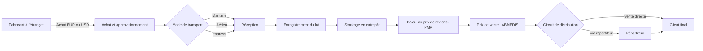
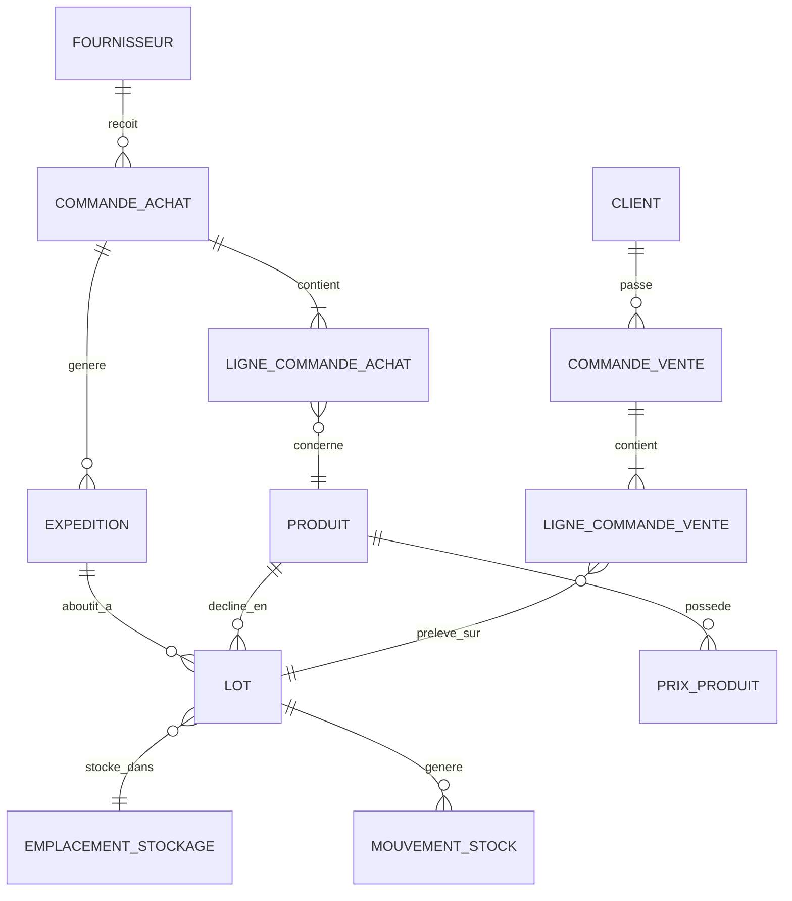

# PRD — Plateforme de Gestion Dépositaire Pharmaceutique LABMEDIS

**Projet :** LABMEDIS — Achats, Stock, Distribution & Ventes
**Version :** 1.0 (brouillon initial pour revue métier)
**Date :** 27 août 2026
**Sources analysées :** `PRD_brut.md`, `Liste_des_clients_et_fournisseurs.xlsx`, `Liste_des_produits_actualisée_LABMEDIS.xlsx`, `Structure_de_prix.xlsx`

---

## 1. Résumé exécutif

LABMEDIS est un dépositaire pharmaceutique togolais opérant en commerce international : elle achète des produits pharmaceutiques, parapharmaceutiques et de diagnostic auprès de fabricants situés en France, au Maroc, en Tunisie, en Inde, en Suisse, au Burkina Faso et au Togo, puis les distribue localement — directement ou via des répartiteurs — vers les pharmacies, cliniques, hôpitaux et centrales d'achat du pays.

Aujourd'hui, ce flux (achat → réception → stockage → tarification → distribution → vente) est piloté manuellement via des fichiers Excel séparés (structure de prix, catalogue produits, listes clients/fournisseurs). Cette approche montre ses limites : pas de traçabilité par lot, calcul du prix de revient fait à la main, aucune anticipation des délais de réapprovisionnement, devises non centralisées, et des incohérences de saisie déjà visibles dans les fichiers actuels (voir section 2.3).

Ce document décrit les exigences fonctionnelles et techniques d'une plateforme logicielle (frontend React, backend .NET 9) destinée à digitaliser l'intégralité de ce cycle : achats multi-devises, réception et traçabilité par lot, gestion d'entrepôt, moteur de tarification (prix d'achat → prix de revient pondéré → prix de vente), distribution, ventes, et prévision des réapprovisionnements.

## 2. Contexte métier

Nous synthétisons ici la description métier fournie et l'analyse des trois fichiers Excel transmis.

### 2.1 Le modèle d'affaires

1. LABMEDIS achète des produits auprès de fabricants étrangers (et d'un fournisseur local togolais). Elle agit comme grand acheteur international : achats en euros (EUR) et en dollars (USD), facturation aux clients en francs CFA (XOF) ou en euros.
2. Les produits sont expédiés par voie maritime, aérienne ou en express — parfois plusieurs modes pour un même produit selon les livraisons.
3. Chaque livraison constitue un **lot**, identifié par un numéro de lot. C'est l'unité de traçabilité de base de l'application.
4. Les lots sont réceptionnés et stockés dans un entrepôt, avec un code de référence par lot et une localisation précise de l'emplacement de stockage.
5. LABMEDIS distribue ensuite les produits soit directement à des clients (pharmacies, cliniques, hôpitaux, centrales d'achat), soit via des **répartiteurs** — des grossistes intermédiaires qui livrent à leur tour les pharmacies.
6. LABMEDIS fixe elle-même ses prix : prix d'achat (PA), prix de revient (PR) et prix de vente (PV), en tenant compte de frais spécifiques au commerce international (commissions, fret, transit, frais de transfert).

### 2.2 Ce que confirment les fichiers fournis

1. **`Liste_des_clients_et_fournisseurs.xlsx`** recense 12 clients (pharmacies, cliniques — ex. *Clinique Mère et Enfant l'Étoile* —, hôpitaux régionaux — *CHP Aného*, *CHR Sokodé* —, la centrale d'achat *CAMEG*, et des grossistes-répartiteurs comme *LABOREX TOGO* ou *UBIPHARM TOGO*) répartis sur plusieurs villes (Lomé, Aného, Sokodé), et 8 fournisseurs internationaux (France, Togo, Maroc, Tunisie, Inde, Suisse, Burkina Faso).
2. **`Liste_des_produits_actualisée_LABMEDIS.xlsx`** contient 138 références réparties en 6 catégories (93 réactifs de laboratoire, 22 médicaments, 17 produits infantiles, 2 cosmétiques, 2 compléments alimentaires, 1 insecticide) et 21 classes thérapeutiques. Chaque produit y est décrit par : désignation, catégorie, forme, dosage, conditionnement (unité + carton), classe thérapeutique, n° de lot, code CIP, date de péremption, fournisseur, régime douanier, origine et type(s) de transport.
3. **`Structure_de_prix.xlsx`** documente précisément le moteur de calcul du prix, entièrement chiffré sur la gamme « France Lait » : prix d'achat en euro converti en CFA au taux fixe **655,957** (parité EUR/XOF), puis majoré par une chaîne de coefficients (commissions/promotion ×1,25, fret ×1,03, transit ×1,09, frais de transfert ×1,07) pour obtenir le prix de revient, puis une marge (×1,10) pour obtenir le prix de vente théorique — que LABMEDIS ajuste ensuite manuellement, l'écart entre prix théorique et prix appliqué étant conservé.

### 2.3 Points de vigilance déjà visibles dans les données actuelles

1. **Incohérences de nommage fournisseur** : un même fournisseur apparaît sous des libellés différents selon les fichiers (« HORIBA » / « HORIBA ABX SAS », « DEO GRATIAS GROUP » / « DEO GRATIAS PHARMA », « MAIA AFRICA SAS » / « Maïa Africa sas »). La plateforme doit imposer une relation stricte vers une fiche fournisseur unique plutôt qu'une saisie libre du nom.
2. **Incohérence de définition de colonne** : dans le fichier produits, la feuille « Liste des produits » utilise `Dosage` pour la contenance unitaire (ex. *boite/400g*) et laisse `Forme` vide, alors que la feuille « Calcul du Prix labmedis » utilise `Forme` pour cette même contenance. Le modèle de données cible (section 9) doit clarifier une définition unique de « Forme » (forme pharmaceutique : comprimé, sirop, crème…) distincte du conditionnement.
3. **Structure de prix partiellement généralisée** : la feuille « Calcul du Prix labmedis » reprend la structure de calcul pour les 137 produits du catalogue, mais seule la colonne TVA est pré-remplie (18 % pour les produits infantiles, cosmétiques et compléments alimentaires ; vide pour les médicaments, l'insecticide et la quasi-totalité des réactifs de laboratoire) — aucun prix d'achat/de revient n'y est encore calculé. Ceci confirme que le calcul de prix n'est aujourd'hui opérationnel que sur un sous-ensemble du catalogue.

## 3. Objectifs du projet

Nous proposons les objectifs suivants, directement dérivés des points de douleur identifiés :

1. Remplacer le suivi manuel (Excel) par une plateforme unique couvrant tout le cycle achat → vente.
2. Garantir une traçabilité complète par lot : origine, fournisseur, transport, date de péremption, emplacement, mouvements.
3. Fiabiliser et automatiser le calcul du prix de revient (coefficients pondérés par mode de transport) et du prix de vente, sur l'intégralité du catalogue.
4. Anticiper les ruptures de stock grâce aux délais de fabrication/livraison propres à chaque produit.
5. Centraliser la gestion multi-devises (EUR, USD, XOF) avec un historique des taux appliqués.
6. Fournir une vision consolidée du stock, des marges et de l'activité commerciale (achats, ventes, répartiteurs).
7. Fiabiliser les référentiels (fournisseurs, catégories, formes) pour éliminer les doublons et incohérences de saisie relevés en 2.3.

## 4. Glossaire métier

1. **Dépositaire** — statut sous lequel LABMEDIS opère ; dans ce document, désigne le rôle d'acheteur international qui prend possession du stock puis le revend.
2. **Répartiteur** — grossiste intermédiaire à qui LABMEDIS vend en gros, et qui livre à son tour les pharmacies. Traité dans l'application comme un type de client (voir 9.3).
3. **Lot** — ensemble de produits reçus lors d'une même livraison, identifié par un numéro de lot unique ; unité de base de traçabilité et de valorisation du stock.
4. **PA (Prix d'Achat)** — prix facturé par le fournisseur, dans sa devise d'origine (EUR, USD…).
5. **PR (Prix de Revient)** — PA converti en XOF puis majoré des coefficients de coûts annexes (commissions, fret, transit, frais de transfert).
6. **PV (Prix de Vente)** — PR majoré d'une marge ; peut être ajusté manuellement par LABMEDIS (le prix réellement appliqué peut différer du prix calculé).
7. **PMP (Prix Moyen Pondéré)** — coût de revient moyen d'un produit, pondéré par les quantités de chaque lot en stock ; utilisé lorsque plusieurs lots du même produit coexistent avec des coûts de revient différents (ex. lots arrivés par bateau vs par avion).
8. **Code CIP** — code d'identification de présentation, standard utilisé pour identifier une présentation pharmaceutique précise.
9. **Régime douanier** — statut douanier appliqué à une importation, déclaré à la réception d'une expédition.
10. **FEFO (First Expired, First Out)** — règle de sortie de stock : les lots dont la date de péremption est la plus proche sont écoulés en priorité.

---

## 5. Périmètre

### 5.1 Inclus dans le périmètre

1. Référentiel produits (catalogue, familles, formes, classes thérapeutiques).
2. Gestion des fournisseurs et des commandes d'achat multi-devises.
3. Suivi logistique des expéditions (mode de transport, délais, régime douanier).
4. Réception et gestion des lots (traçabilité, péremption, emplacement).
5. Gestion d'entrepôt et mouvements de stock.
6. Moteur de tarification (PA → PR pondéré → PV, TVA).
7. Gestion des clients et répartiteurs.
8. Commandes de vente et facturation.
9. Prévision de réapprovisionnement basée sur les délais fournisseurs.
10. Gestion multi-devises et taux de change.
11. Tableaux de bord et reporting (stock, marges, activité).
12. Gestion des utilisateurs, rôles et permissions.
13. Notifications temps réel (stock bas, péremption proche, retards).

### 5.2 Hors périmètre (v1) — à confirmer

1. Comptabilité générale complète (grand livre, bilan) — la plateforme calcule les prix et émet des documents de vente/achat, mais ne remplace pas un logiciel comptable.
2. Portail self-service pour les répartiteurs ou clients (commande en ligne) — les répartiteurs restent gérés comme des clients par les équipes LABMEDIS en v1.
3. Application mobile native — le frontend React couvre le web desktop et mobile en responsive ; une application native n'est pas prévue à ce stade.
4. Intégration automatique à une API de taux de change externe — en v1, les taux (notamment USD/XOF) sont saisis/actualisés manuellement par un administrateur ; l'EUR/XOF reste fixe (655,957).

## 6. Utilisateurs & rôles

1. **Direction / Gérance** — vision globale (stock, marges, activité), validation des prix de vente.
2. **Responsable Achats** — gestion des fournisseurs, création et suivi des commandes d'achat, suivi des délais de fabrication/livraison.
3. **Responsable Entrepôt / Magasinier** — réception des lots, gestion des emplacements, mouvements de stock, contrôle des péremptions.
4. **Responsable Tarification** — paramétrage des coefficients de coûts, validation du prix de revient et du prix de vente.
5. **Responsable Commercial / Ventes** — gestion des clients et répartiteurs, commandes de vente, facturation.
6. **Administrateur système** — gestion des utilisateurs, rôles, devises, taux de change, paramètres généraux.

Ces rôles s'appuient sur le système d'authentification/autorisation décrit en section 12 (Identity + attribut `[Authorize]`).

## 7. Processus métier

### 7.1 Vue d'ensemble



### 7.2 Flux détaillé

1. **Anticipation & commande** — sur la base du délai de fabrication + livraison estimé pour un produit (ex. 3 à 4 mois), le système alerte lorsqu'un réapprovisionnement doit être lancé avant la rupture de stock.
2. **Commande d'achat** — le Responsable Achats crée une commande auprès d'un fournisseur, dans la devise du fournisseur (EUR/USD), avec quantités et prix d'achat par produit.
3. **Expédition** — la commande donne lieu à une ou plusieurs expéditions, chacune avec son propre mode de transport (maritime, aérien, express), ce qui influence les coefficients de coût appliqués.
4. **Réception & lot** — à l'arrivée, chaque expédition est réceptionnée et enregistrée comme un ou plusieurs lots : quantité réelle reçue (indépendamment d'un nombre standard par carton, qui peut varier d'un lot à l'autre), date de péremption, emplacement de stockage.
5. **Valorisation** — le prix de revient du lot est calculé automatiquement (PA converti en XOF, puis coefficients selon le mode de transport). Le prix de revient du produit (PMP) est recalculé en pondérant tous les lots disponibles.
6. **Tarification** — le prix de vente théorique est calculé (PR × marge) ; le prix réellement appliqué peut être ajusté manuellement, l'écart étant conservé pour analyse.
7. **Distribution & vente** — le produit est vendu directement à un client final (pharmacie, clinique, hôpital, centrale d'achat) ou à un répartiteur qui le redistribue. La sortie de stock privilégie les lots dont la péremption est la plus proche (FEFO).
8. **Suivi** — chaque mouvement (réception, transfert, vente, ajustement) est historisé pour permettre la traçabilité complète d'un lot, de sa réception à sa vente.

---

## 8. Exigences fonctionnelles

Les exigences sont regroupées par module. Chaque module correspond à un domaine métier cohérent, réutilisable comme granularité pour le découpage en user stories lors du développement.

### 8.1 Module — Référentiel Produits

1. Créer, consulter, modifier et archiver (suppression logique) une fiche produit : désignation, catégorie/famille, forme pharmaceutique, dosage, classe thérapeutique, principe actif, code CIP, conditionnement (unité de vente + regroupement carton).
2. Associer un ou plusieurs fournisseurs habituels à un produit, avec le pays d'origine par défaut.
3. Renseigner, par produit, le délai estimé de fabrication et le délai de livraison, utilisés par le module de prévision (8.9).
4. Définir un seuil de stock de sécurité par produit.
5. Rechercher et filtrer les produits par catégorie, forme, classe thérapeutique, fournisseur ou statut.
6. Gérer catégories, formes et classes thérapeutiques comme des référentiels paramétrables (listes contrôlées), pour mettre fin à la saisie libre observée dans les fichiers Excel actuels.

### 8.2 Module — Fournisseurs & Achats

1. Créer et gérer une fiche fournisseur unique : nom, adresse, boîte postale, téléphone, pays, devise de facturation habituelle.
2. Créer une commande d'achat : fournisseur, devise, lignes (produit, quantité, prix d'achat unitaire), date de commande, date de livraison prévue (calculée à partir du délai du produit).
3. Suivre le statut d'une commande d'achat (brouillon → envoyée → confirmée → partiellement reçue → reçue → annulée).
4. Rattacher une ou plusieurs expéditions à une commande d'achat (une commande peut être livrée en plusieurs fois, avec des modes de transport différents).
5. Historiser les commandes par fournisseur pour analyse (volumes, délais réels vs délais estimés).

### 8.3 Module — Logistique & Transport

1. Enregistrer, pour chaque expédition, le mode de transport (maritime, aérien, express), le transporteur, la référence de transport (n° de conteneur, connaissement, etc.), la date d'expédition et la date d'arrivée (estimée puis réelle).
2. Enregistrer le régime douanier appliqué à l'expédition.
3. Permettre à une même commande d'achat de générer plusieurs expéditions utilisant des modes de transport différents.
4. Calculer automatiquement l'écart entre date de livraison prévue et date de livraison réelle, pour affiner les futures estimations de délai.

### 8.4 Module — Réception & Gestion des Lots

1. Réceptionner une expédition et créer un ou plusieurs lots, chacun identifié par un numéro de lot unique.
2. Saisir, par lot : quantité réellement reçue (en unités, indépendamment du nombre standard par carton), nombre de cartons et unités par carton observées à la réception, date de péremption, emplacement de stockage.
3. Empêcher la création de deux lots portant le même numéro pour un même fournisseur/produit (contrôle d'unicité).
4. Consulter l'historique complet d'un lot : réception, mouvements, ventes associées.
5. Bloquer un lot (mise en quarantaine) en cas de non-conformité, sans le sortir du stock physique tant qu'il n'est pas statué.

### 8.5 Module — Entreposage & Stock

1. Définir la structure de l'entrepôt : zones, rangées, étagères ou tout autre découpage utilisé par LABMEDIS, sous forme d'emplacements codifiés.
2. Affecter un lot à un ou plusieurs emplacements de stockage.
3. Enregistrer tout mouvement de stock (entrée, sortie, transfert d'emplacement, ajustement d'inventaire) avec utilisateur, date et référence (commande d'achat ou de vente).
4. Consulter le stock disponible par produit, par lot et par emplacement, avec la date de péremption la plus proche mise en avant.
5. Appliquer la règle FEFO comme proposition par défaut lors d'une sortie de stock, avec possibilité de sélection manuelle du lot par un utilisateur autorisé.
6. Réaliser un inventaire (comptage physique) et ajuster le stock théorique en conséquence, avec justification obligatoire de l'écart.

### 8.6 Module — Tarification

1. Paramétrer, par produit ou par catégorie, les coefficients de coûts annexes (commissions/promotion, fret, transit, frais de transfert), avec des valeurs pouvant différer selon le mode de transport (maritime vs aérien vs express).
2. Calculer automatiquement le prix de revient d'un lot : prix d'achat converti en XOF, multiplié par la chaîne de coefficients applicables.
3. Calculer le prix de revient moyen pondéré (PMP) d'un produit à partir des lots disponibles en stock, recalculé à chaque nouvelle réception.
4. Calculer un prix de vente théorique (PR × marge configurable).
5. Permettre la saisie d'un prix de vente manuel (« Prix LABMEDIS ») différent du prix théorique, en conservant l'écart entre les deux pour le suivi de la marge.
6. Appliquer la TVA (18 % par défaut, configurable par produit/catégorie — voir point ouvert en section 13) pour obtenir le prix de vente TTC.
7. Historiser toute évolution de prix (date d'effet, ancien prix, nouveau prix, auteur du changement).
8. Permettre l'application de cette structure de calcul à l'ensemble du catalogue, produit par produit ou par lot d'import (cf. constat 2.3.3).

### 8.7 Module — Clients & Répartiteurs

1. Créer et gérer une fiche client unique : nom, type (pharmacie, clinique, hôpital, centrale d'achat, répartiteur, autre), adresse, boîte postale, téléphone, ville.
2. Filtrer et regrouper les clients par type et par zone géographique.
3. Historiser les commandes et le volume d'affaires par client.
4. Distinguer, dans les rapports, les ventes réalisées directement des ventes réalisées via un répartiteur.

### 8.8 Module — Ventes & Facturation

1. Créer une commande de vente : client, devise, lignes (produit, quantité, prix de vente unitaire), avec proposition automatique du lot à sortir selon la règle FEFO.
2. Vérifier la disponibilité du stock au moment de la saisie de la commande.
3. Générer un document de vente (bon de livraison / facture) exportable en PDF.
4. Suivre le statut d'une commande de vente (brouillon → confirmée → livrée → facturée → annulée).
5. Permettre la facturation en XOF ou en EUR selon le client.

### 8.9 Module — Prévision & Réapprovisionnement

1. Calculer, pour chaque produit, un point de commande (seuil de réapprovisionnement) à partir de la consommation moyenne constatée et du délai total (fabrication + livraison) du produit.
2. Générer une alerte lorsque le stock disponible d'un produit atteint son point de commande, en indiquant la quantité suggérée et la date limite pour lancer la commande.
3. Fournir une vue consolidée des produits à réapprovisionner, triable par urgence (délai restant avant rupture estimée).
4. Permettre la création d'une commande d'achat directement depuis une alerte de réapprovisionnement.

### 8.10 Module — Multi-devises

1. Gérer un référentiel de devises (EUR, USD, XOF au minimum).
2. Gérer un taux de change par paire de devises, avec date d'application et historique (taux fixe pour EUR/XOF à 655,957 ; taux actualisable manuellement pour USD/XOF).
3. Convertir et afficher tout montant (achat, revient, vente) dans sa devise d'origine et en XOF (devise de référence de gestion).
4. Conserver, sur chaque transaction, le taux de change utilisé au moment de la transaction, pour ne pas fausser l'historique en cas de changement ultérieur du taux.

### 8.11 Module — Reporting & Tableaux de bord

1. Tableau de bord stock : valeur du stock, produits proches de la rupture, produits proches de la péremption.
2. Tableau de bord achats : commandes en cours, délais moyens fournisseurs, répartition par devise.
3. Tableau de bord ventes : chiffre d'affaires par période, par client/type de client, par produit, marge réalisée (PV − PR).
4. Export des rapports en PDF et/ou Excel.

### 8.12 Module — Utilisateurs, Rôles & Sécurité

1. Authentification des utilisateurs (ASP.NET Identity).
2. Gestion des rôles et permissions par module (ex. le Magasinier ne modifie pas les prix, le Commercial ne modifie pas les coefficients de coûts).
3. Journalisation de toute action sensible (création/modification/suppression) avec utilisateur, date, IP — format imposé en section 12.5.
4. Suppression logique uniquement (`IsDeleted`) : aucune donnée métier n'est supprimée physiquement.

### 8.13 Module — Notifications

1. Notifier en temps réel (SignalR, sans polling) les utilisateurs concernés lors : d'une alerte de réapprovisionnement, d'un lot proche de la péremption, d'un retard de livraison détecté.
2. Permettre l'envoi de notifications par email ou SMS pour les alertes critiques, via un service de notification centralisé.

### 8.14 Module — Documents & Conformité

1. Conserver, par lot, les documents associés (facture fournisseur, document douanier, certificat éventuel) sous forme de pièces jointes.
2. Assurer la traçabilité complète d'un produit vendu jusqu'à son lot d'origine (fournisseur, expédition, date de réception) — capacité de rappel de lot en cas de besoin.

---

## 9. Modèle de données

Toutes les entités héritent d'une entité de base commune (`BaseEntity`) portant `Id`, `CreatedAt`, `UpdatedAt`, `IsDeleted` (voir section 12) ; ces quatre champs ne sont pas répétés ci-dessous.

### 9.1 Schéma relationnel simplifié



### 9.2 Entités principales

1. **Produit** — désignation, catégorie, forme, dosage, conditionnement (unité + carton), classe thérapeutique, principe actif, code CIP, origine par défaut, délai de fabrication estimé, délai de livraison estimé, seuil de stock de sécurité, statut.
2. **Fournisseur** — nom, adresse, boîte postale, téléphone, pays, devise habituelle.
3. **CommandeAchat** — fournisseur, date de commande, date de livraison prévue, devise, Incoterm, statut, taux de change appliqué.
4. **LigneCommandeAchat** — commande, produit, quantité commandée, prix d'achat unitaire.
5. **Expedition** — commande d'achat, mode de transport (maritime/aérien/express), transporteur, référence transport, régime douanier, date d'expédition, date d'arrivée prévue/réelle.
6. **Lot** — produit, expédition, numéro de lot, quantité reçue, date de réception, date de péremption, coefficients de coût appliqués, prix de revient calculé, statut (disponible/bloqué/épuisé/périmé).
7. **Entrepot** — nom, adresse.
8. **EmplacementStockage** — entrepôt, code (zone/rangée/étagère), capacité.
9. **MouvementStock** — lot, type (entrée/sortie/transfert/ajustement), quantité, date, utilisateur, référence source (commande achat/vente/inventaire).
10. **PrixProduit** — produit, PR (PMP courant), PV HT calculé, PV HT appliqué, écart, taux de TVA, date d'effet.
11. **Client** — nom, type (pharmacie/clinique/hôpital/centrale d'achat/répartiteur/autre), adresse, boîte postale, téléphone, ville, délai de paiement, plafond d'encours autorisé.
12. **CommandeVente** — client, date, devise, statut, montant HT/TTC.
13. **LigneCommandeVente** — commande, produit, lot, quantité, prix de vente unitaire.
14. **Devise** — code (EUR/USD/XOF), libellé, symbole.
15. **TauxDeChange** — devise source, devise cible, taux, date d'application, type (fixe/variable).
16. **Utilisateur** — nom, prénom, email, rôle(s), statut (géré via ASP.NET Identity).
17. **Notification** — type, destinataire, canal (SignalR/email/SMS), statut lu/non lu, référence source.

### 9.3 Décision de conception — Répartiteur

Le « répartiteur » n'est pas modélisé comme une entité distincte : c'est un `Client` dont le champ `Type` vaut *Répartiteur*. Cela reflète la liste de clients fournie, qui mélange déjà pharmacies, cliniques et grossistes-répartiteurs (ex. LABOREX TOGO, UBIPHARM TOGO) dans une même liste. Cette décision est à valider avec LABMEDIS si un traitement réellement différencié (ex. portail dédié, conditions commerciales spécifiques) s'avère nécessaire.

## 10. Règles de gestion critiques

1. **Unicité du lot** — un numéro de lot est unique par couple fournisseur/produit ; deux lots ne peuvent partager le même numéro pour le même produit.
2. **Quantité par lot indépendante du conditionnement standard** — la quantité reçue est saisie en unités réelles ; le nombre d'unités par carton peut varier d'un lot à l'autre pour un même produit et n'est jamais utilisé comme base de calcul de la quantité totale.
3. **Conversion EUR/XOF fixe** — tout prix d'achat en euro est converti en XOF au taux fixe 655,957 (parité officielle), non modifiable sans intervention explicite d'un administrateur.
4. **Prix de revient pondéré par mode de transport** — les coefficients de fret/transit appliqués à un lot dépendent de son mode de transport ; le prix de revient produit (PMP) pondère les lots en stock par leur quantité restante et leur prix de revient respectif, recalculé à chaque réception.
5. **FEFO par défaut** — toute sortie de stock propose par défaut le lot dont la date de péremption est la plus proche ; une dérogation manuelle reste possible mais tracée.
6. **Traçabilité intégrale** — chaque produit vendu doit pouvoir être remonté jusqu'à son lot, son expédition et son fournisseur d'origine.
7. **Aucune suppression physique** — toute suppression de donnée métier passe par `IsDeleted = true` (soft delete), jamais par une suppression en base.
8. **Écart de prix conservé** — tout écart entre le prix de vente calculé et le prix réellement appliqué (« Prix LABMEDIS ») est conservé, jamais écrasé, pour permettre le suivi de la politique tarifaire.

## 11. Exigences non fonctionnelles

1. **Sécurité** — authentification obligatoire, autorisation par rôle sur chaque contrôleur (`[Authorize]`), traçabilité de chaque action sensible.
2. **Auditabilité** — horodatage (`CreatedAt`/`UpdatedAt`) et auteur sur toute donnée métier, conservation de l'historique de prix et des mouvements de stock.
3. **Disponibilité** — application utilisée en journée ouvrée par les équipes LABMEDIS ; une disponibilité standard (hors maintenance planifiée) est suffisante pour une v1.
4. **Performance** — le catalogue (quelques centaines de produits), le stock et les commandes doivent rester consultables sans latence perceptible pour un usage interne à l'échelle de l'entreprise.
5. **Internationalisation des données** — gestion native de plusieurs devises et formats de date/nombre ; interface en français.
6. **Compatibilité** — frontend React responsive (poste fixe et tablette pour l'entrepôt).
7. **Traitements de masse** — les imports/mises à jour volumineux (ex. migration du catalogue Excel existant) utilisent les opérations en masse (`BulkInsertAsync`/`BulkUpdateAsync`) plutôt que des insertions unitaires.
8. **Temps réel** — les notifications utilisent SignalR, sans sondage (polling) côté client.

---

## 12. Architecture technique

Cette section documente les conventions d'implémentation à respecter **strictement** — elles priment sur toute proposition d'architecture alternative, aussi standard soit-elle par ailleurs.

### 12.1 Organisation du dépôt

1. `./codebase/frontend` — application React.
2. `./codebase/backend` — application .NET 9, organisée en 3 couches :
   - `[Projet].Core` — entités, interfaces, repositories (Entity Framework Core).
   - `[Projet].Service` — logique métier, DTOs (Requests/Responses), services, jobs (Hangfire), SignalR.
   - `[Projet].Presentation` — `[Projet].Api` (contrôleurs API) et/ou `[Projet].BackOffice` (contrôleurs MVC, vues Razor, JS).

### 12.2 Règles d'or (non négociables)

1. **Héritage Service/Repository** — le Service hérite du Repository, il ne l'injecte jamais par constructeur : `class [Entité]Service : [Entité]Repository, I[Entité]Service`.
2. **Soft delete** — toute suppression passe par `IsDeleted = true`, jamais de suppression physique.
3. **Logging** — exclusivement `ILoggerManager` (wrapper NLog du projet) ; jamais `ILogger<T>` standard.
4. **Mapping** — mapping manuel privilégié ; si AutoMapper est requis, le `Profile` vit dans le même fichier physique que le Request correspondant.
5. **Champs numériques en DTO Request** — toujours en `string` (jamais `decimal`/`double` directement), avec conversion manuelle (`.ToDouble()` ou équivalent), pour éviter les problèmes de formatage culturel côté frontend.

### 12.3 Couche Core (`[Projet].Core`)

1. Les entités héritent de `BaseEntity` (`Id`, `CreatedAt`, `UpdatedAt`, `IsDeleted`), placées dans `/Models/Entities`.
2. Interface de repository : `I[Entité]Repository`.
3. Classe de repository : `[Entité]Repository : BaseRepository<[Entité]>, I[Entité]Repository`.
4. Le repository spécifique ne contient que les requêtes complexes (`.Include`, `.ThenInclude`, `Where` avancés) ; le CRUD de base vient de `BaseRepository`.

### 12.4 Couche Service (`[Projet].Service`)

1. **DTO Request** — annoté `[SwaggerSchema(Description = "...")]` si utile, champs décimaux/monétaires en `string`, méthode de mapping manuel `public [Entité] To[Entité]()`.
2. **DTO Response** — constructeur prenant l'entité en paramètre pour mapping manuel : `public [Entité]Response([Entité] entity) { this.Id = entity.Id; ... }`.
3. **Service** — implémente l'interface et hérite du repository (règle d'or n°1).
4. **Jobs planifiés** — exclusivement via Hangfire, placés dans `[Projet].Service/Jobs` (ex. calcul quotidien des alertes de réapprovisionnement, détection des lots proches de la péremption).
5. **Temps réel** — SignalR pour toute notification, sans polling.
6. **Notifications externes** — SMS/email via `INotificationService` (FluentEmail / Twilio).

### 12.5 Couche Présentation — API (`[Projet].Api`)

Structure obligatoire de chaque action de contrôleur :

1. Attributs `[ApiController]`, `[Route("api/[controller]")]`, `[Authorize]`.
2. Injection de `I[Entité]Service`, `ILoggerManager`, et `IUserService` si le contexte utilisateur est requis.
3. Récupération de l'utilisateur courant.
4. Log d'information avant l'action, au format exact :
   ```csharp
   _logger.LogInfo($"{user?.LastName} {user?.FirstName} ({user?.UserName}) | Début [NomAction] | {Request.Method} {Request.Path} {Request.GetRequestData()} IP: {Request.GetIp()} UserManager: {Request.GetUserAgentName()}");
   ```
5. Bloc `try { ... } catch (Exception ex) { ... }` : le `try` appelle le service et retourne le résultat (`Ok(response)`) ; le `catch` logue l'erreur et retourne `BadRequest(new { message = "..." })` — **jamais** `StatusCode(500)` (le middleware global gère les crashs critiques) :
   ```csharp
   _logger.LogError(ex, $"{user?.LastName} ... | Echec [NomAction] : {ex.Message} | IP: {Request.GetIp()}");
   ```
6. **Notifications UI (BackOffice)** — avant un `RedirectToAction` : `Notif.Success($"Opération réussie", new string[] { "Toast" });` ou `Notif.Error($"Erreur : {ex.Message}", new string[] { "Toast" });`.

### 12.6 Stack technique de référence

1. **Données** — `Microsoft.EntityFrameworkCore.SqlServer`, `EFCore.BulkExtensions`.
2. **Sécurité** — `Microsoft.AspNetCore.Identity.EntityFrameworkCore`.
3. **Tâches de fond / temps réel** — `Hangfire`, `Microsoft.AspNetCore.SignalR.StackExchangeRedis`.
4. **Utilitaires** — `NLog`, `UAParser` (User-Agent), `DinkToPdf` (PDF — bons de livraison, factures, rapports), `FluentEmail`, `Stripe` (si paiement en ligne envisagé).

### 12.7 Frontend (React)

1. Application React consommant l'API .NET via HTTP/REST, et SignalR pour le temps réel.
2. Découpage par module fonctionnel (aligné sur la section 8), avec des composants réutilisables pour les écrans récurrents de type liste/formulaire/détail.
3. Gestion centralisée de l'authentification et des permissions par rôle, cohérente avec les rôles définis en section 6.
4. Interface entièrement en français, formatage des devises et des dates adapté au contexte togolais/CFA.
5. Choix précis (gestion d'état, structure de dossiers, librairie de composants) à arrêter lors du cadrage technique détaillé — non spécifiés dans les échanges fournis à ce stade.

---

## 13. Hypothèses & questions ouvertes

Points où une interprétation a été nécessaire ; à valider avec LABMEDIS avant le développement.

1. **Granularité de traçabilité** — la description métier évoque un enregistrement « unique » des produits reçus. Ce document retient une traçabilité au niveau du lot (quantité précise par lot, section 10.2). Si LABMEDIS a besoin d'une traçabilité unité par unité (numéro de série individuel), la structure de `MouvementStock` devra être revue en conséquence.
2. **Définition du champ « Forme »** — à clarifier entre contenance/conditionnement (ex. *boite/400g*, utilisé comme tel dans un des deux fichiers) et forme pharmaceutique proprement dite (comprimé, sirop, crème…), voir constat 2.3.2.
3. **Taux de change appliqué** — à quelle date fige-t-on le taux USD/XOF pour un achat : date de commande, date de réception, ou date de paiement fournisseur ? Le taux EUR/XOF, lui, est fixe.
4. **Fréquence de recalcul du PMP** — recalcul à chaque réception de lot (retenu par défaut) ou à chaque mouvement de stock ?
5. **Rôle des répartiteurs** — traités comme un type de client en v1 (section 9.3) ; un accès applicatif dédié aux répartiteurs (portail externe) est-il souhaité en v2 ?
6. **TVA par catégorie** — probablement expliqué par la Directive UEMOA n° 06/2002/CM/UEMOA, qui exonère de TVA une liste communautaire de médicaments (voir section 17.4) : les produits infantiles, cosmétiques et compléments alimentaires n'y figurant pas restent taxés à 18 %. Reste à confirmer, présentation par présentation (code CIP), que chaque médicament du catalogue LABMEDIS relève bien de cette liste.
7. **Comptabilité générale** — périmètre exclu par défaut (section 5.2) ; à confirmer si une interface d'export vers un logiciel comptable existant est nécessaire dès la v1.

## 14. Annexes — synthèse des données sources

1. **Clients (12)** — pharmacies/dépôts (POUPONNIERE TOKOIN/BONJOUR BEBE, DOGTA LAFIE, TEDIS PHARMA TOGO), cliniques (Clinique Mère et Enfant l'Étoile, Clinique les p'tits anges), hôpitaux (CHP Aného, CHR Sokodé), centrale d'achat (CAMEG), grossistes-répartiteurs (LABOREX TOGO, UBIPHARM TOGO), et autres (OCDI, Groupe Levant Sarl) — répartis entre Lomé, Aného et Sokodé.
2. **Fournisseurs (8)** — Continental Commodities et HORIBA ABX SAS (France), DEO GRATIAS PHARMA (Togo), IBERMA (Maroc), GALPHARMA (Tunisie), B&B LIFE SCIENCE (Inde), BIORESEARCH (Suisse), Maïa Africa SAS (Burkina Faso).
3. **Catalogue produits (138 références)** — 93 réactifs de laboratoire, 22 médicaments, 17 produits infantiles, 2 cosmétiques, 2 compléments alimentaires, 1 insecticide ; 21 classes thérapeutiques représentées.
4. **Structure de prix** — exemple entièrement chiffré sur la gamme « France Lait » (17 références) : PA en euro converti en CFA (×655,957), coefficients commissions/promo ×1,25, fret ×1,03, transit ×1,09, frais de transfert ×1,07, marge ×1,10, TVA 18 %. Le reste du catalogue partage la même structure cible mais n'est pas encore chiffré (constat 2.3.3).

---

## 15. Prochaines étapes suggérées

1. Valider ce PRD avec LABMEDIS, en priorité les points de la section 13.
2. Prioriser les modules pour un MVP (probablement : Produits, Fournisseurs/Achats, Lots/Stock, Tarification, Clients/Ventes — en différant Prévision avancée et Reporting poussé).
3. Concevoir le schéma de base de données détaillé (types précis, contraintes, index) à partir du modèle de données (section 9).
4. Découper les modules en user stories pour le développement de `./codebase/backend` et `./codebase/frontend`.

---

## 16. Documents complémentaires à collecter

Le présent PRD s'appuie sur les quatre documents fournis. Les documents suivants, s'ils existent chez LABMEDIS, permettraient de lever les hypothèses de la section 13 et de fiabiliser plusieurs modules.

### 16.1 Cadre réglementaire

Le cadre général applicable (licence, douane, TVA, BPD) est désormais détaillé en section 17, à partir de sources publiques. Restent à obtenir directement auprès de LABMEDIS et de la DPML :

1. Copie de la licence d'exploitation de dépositaire (numéro, date de délivrance/expiration) — voir 17.1.
2. Confirmation du classement TVA précis de chaque présentation du catalogue (code CIP) et des régimes douaniers effectivement utilisés — voir 17.3 et 17.4.
3. Confirmation que les produits LABMEDIS ne nécessitent pas de chaîne du froid ou d'autres conditions de stockage spéciales visées par les BPD — voir 17.5.

### 16.2 Gabarits opérationnels actuels

Des propositions de gabarits, à confronter aux documents réels, figurent en section 18. Restent à obtenir de LABMEDIS :

4. Le modèle réel de bon de commande fournisseur, pour valider ou corriger la proposition 18.1.
5. Le modèle réel de facture / bon de livraison client, pour valider ou corriger la proposition 18.2.
6. Un exemplaire de document de transport type (connaissement, LTA, déclaration en douane), pour vérifier la grille de saisie 18.3.
7. Le plan réel de l'entrepôt, pour remplacer la convention de codification proposée en 18.4.

### 16.3 Données complémentaires

Les méthodes de calcul et gabarits de collecte sont proposés en section 19 ; les données elles-mêmes restent à obtenir de LABMEDIS :

8. Structure de prix chiffrée pour les catégories autres que « France Lait », catégorie par catégorie — voir gabarit 19.1.
9. Historique des ventes ou de rotation de stock, pour alimenter le calcul 19.2.
10. Stock actuel, au format du gabarit 19.3, si un inventaire de départ doit être repris dans le système.

### 16.4 Organisation & règles de gestion

Des règles de gestion standards sont proposées en section 20, à calibrer avec les pratiques réelles de LABMEDIS :

11. Organigramme LABMEDIS, pour confirmer les rôles de la section 6 et le seuil de validation proposé en 20.2.
12. Conditions commerciales clients réelles (délais de paiement, plafonds d'encours, remises), pour calibrer la proposition 20.1.
13. Politique de retours/avoirs réelle, pour valider ou ajuster le processus proposé en 20.3.

Les points 1, 2 et 8 sont les plus structurants pour la suite : ils conditionnent directement le moteur de tarification et la conformité réglementaire, cœur du système.

---

## 17. Cadre réglementaire applicable (Togo / UEMOA)

Section établie par recherche documentaire (sources publiques citées en fin de section) pour compléter le point 16.1. Elle donne le cadre général ; les éléments propres à LABMEDIS (numéro de licence, autorisations d'importation en cours, produits effectivement enregistrés) restent à obtenir directement auprès de l'entreprise et de la DPML.

### 17.1 Statut et licence d'exploitation

1. L'activité de dépositaire, comme celle de grossiste-répartiteur, relève d'un établissement pharmaceutique soumis à licence d'exploitation délivrée par la **Direction de la Pharmacie, du Médicament et des Laboratoires (DPML)**, sous tutelle du ministère chargé de la Santé.
2. Ces établissements ne peuvent être détenus que par des pharmaciens ; le dossier de demande/renouvellement comprend notamment le dossier du ou des pharmaciens responsables, la liste des produits commercialisés, le plan des locaux et une attestation d'engagement à respecter la réglementation en vigueur.
3. La licence est délivrée pour 5 ans, renouvelable (délai de traitement observé : environ 3 mois).
4. Base légale : loi n° 2009-007 du 15 mai 2009 portant Code de la santé publique, complétée par les décrets fixant les conditions d'exercice de grossiste-répartiteur et de grossiste-dépositaire.

Implication pour la plateforme : conserver, sur la fiche entreprise (paramétrage), le numéro de licence et sa date d'expiration, avec une alerte avant échéance (mécanisme similaire à l'alerte de péremption produit, module 8.13).

### 17.2 Autorisation d'importation

1. Aucun médicament ne peut être importé au Togo sans autorisation de la commission nationale d'enregistrement des médicaments ; les produits non autorisés sont saisis par la douane et transmis au ministère de la Santé.
2. Les grossistes-répartiteurs et grossistes-dépositaires agréés doivent en outre solliciter, auprès de la DPML, une autorisation d'importation (spéciale ou officielle selon les cas) pour chaque opération, en présentant leur agrément et les certificats de conformité des produits.
3. Depuis 2024, une plateforme numérique impose, pour certains « produits sensibles », un certificat de déclaration préalable avant le lancement de toute importation — à vérifier si les produits pharmaceutiques y sont soumis dans le cas de LABMEDIS.

Implication pour la plateforme : chaque `CommandeAchat` ou `Expedition` internationale devrait pouvoir référencer une autorisation d'importation (numéro, date, statut), en complément des documents douaniers déjà prévus au module 8.14.

### 17.3 Régimes douaniers (Office Togolais des Recettes)

L'OTR reconnaît les régimes douaniers suivants, à utiliser comme référentiel du champ « Régime douanier » de l'entité `Expedition` (section 9.2) :

1. Mise à la consommation
2. Exportation
3. Entrepôt de stockage
4. Entrepôt industriel
5. Admission temporaire
6. Exportation temporaire
7. Usine exercée
8. Transit
9. Réexportation
10. Zone franche
11. Drawback et exportation préalable (remboursement)

La majorité des importations LABMEDIS relèveront vraisemblablement de la **mise à la consommation**, qui donne lieu au paiement du droit de douane, de la redevance statistique, du prélèvement communautaire de solidarité UEMOA, du prélèvement communautaire CEDEAO, de la redevance d'inspection/vérification, de la taxe de la Chambre de Commerce, de la taxe de péage (Port Autonome de Lomé) et de la TVA à l'importation.

### 17.4 TVA — éclaircissement du point 13.6

La Directive UEMOA n° 06/2002/CM/UEMOA établit une liste communautaire de médicaments, produits pharmaceutiques et matériels médicaux spécialisés exonérés de TVA, que chaque État membre transpose. Ceci explique vraisemblablement pourquoi, dans le fichier `Calcul du Prix labmedis`, la TVA est renseignée à 18 % pour les produits infantiles, cosmétiques et compléments alimentaires (hors de cette liste) mais absente pour les médicaments (probablement exonérés). Reste à confirmer, avec un expert-comptable ou l'OTR, que chaque référence du catalogue LABMEDIS est bien classée du bon côté de cette liste : c'est la présentation précise (code CIP), pas la seule catégorie « médicament », qui détermine juridiquement l'exonération.

Implication pour la plateforme : le taux de TVA doit rester un champ configurable par produit (déjà prévu en 8.6.6), jamais déduit automatiquement de la catégorie.

### 17.5 Bonnes pratiques de distribution (BPD)

En l'absence de guide togolais spécifique identifié, la référence de facto pour la distribution en gros de produits pharmaceutiques est le guide OMS des Bonnes Pratiques de Distribution (WHO-GDP), complété par l'harmonisation UEMOA (règlements n° 02/2005, n° 06/2010 puis n° 04/2020/CM/UEMOA pour l'homologation des produits). Les exigences les plus directement applicables à la plateforme :

1. Vérifier qu'un fournisseur dispose d'une autorisation de distribution en gros avant de le référencer (contrôle à ajouter au module Fournisseurs, 8.2).
2. Vérifier que le client dispose d'une autorisation/licence adaptée (pharmacie, dépôt, grossiste) avant de lui livrer (contrôle à ajouter au module Clients, 8.7).
3. Réaliser des inventaires réguliers et documenter tout écart (déjà couvert en 8.5.6).
4. Isoler et étiqueter les produits suspectés falsifiés ou non conformes, en informant l'autorité compétente (déjà couvert par le blocage de lot, 8.4.5, à enrichir d'un statut « suspecté falsifié »).
5. Tenir un état des quantités livrées vs récupérées en cas de rappel de lot (déjà couvert par 8.14.2).
6. Un dépositaire peut stocker des lots non encore « libérés » par le fabricant/importateur, mais ne peut les distribuer avant leur libération formelle — ceci justifie l'ajout d'un statut de lot dédié « en attente de libération » dans l'entité `Lot` (section 9.2), en complément des statuts déjà prévus (disponible/bloqué/épuisé/périmé).

### 17.6 Portée régionale

Le Togo appartient à l'UEMOA (harmonisation pharmaceutique en cours depuis 2003) et à la CEDEAO. Les compléments alimentaires et les cosmétiques font l'objet d'une homologation communautaire distincte de celle des médicaments — à vérifier si les produits infantiles et cosmétiques du catalogue LABMEDIS (ex. gamme France Lait, Pommade Maïa) disposent des homologations correspondantes.

---

**Sources principales consultées :** Direction de la Pharmacie, du Médicament et des Laboratoires (dpml.tg) ; service-public.gouv.tg ; Togo First ; Office Togolais des Recettes (otr.tg) ; loi n° 2009-007 du 15 mai 2009 portant Code de la santé publique du Togo ; règlements et directives du Conseil des Ministres de l'UEMOA (n° 02/2005, n° 06/2002, n° 06/2010, n° 04/2020, n° 06/2020) ; guide OMS des Bonnes Pratiques de Distribution (WHO-GDP).

---

## 18. Gabarits opérationnels proposés

Ces gabarits ne remplacent pas les documents réels de LABMEDIS (à obtenir en priorité — section 16.2) : ce sont des propositions standards, construites à partir du modèle de données (section 9) et du cadre réglementaire (section 17), à confronter à l'existant.

### 18.1 Bon de commande fournisseur

En-tête :
1. N° de commande, date d'émission.
2. Émetteur : LABMEDIS, n° de licence dépositaire (17.1).
3. Fournisseur : nom, adresse, pays.
4. Devise (EUR/USD), Incoterm (FOB, CIF, EXW…), mode de transport prévu.
5. Date de livraison souhaitée (calculée à partir du délai produit, module 8.9).

Lignes (répétées par produit) :
6. Désignation, code CIP, quantité commandée, prix d'achat unitaire, devise, montant ligne.

Pied :
7. Montant total, conditions de paiement, signature/validation interne.

Champ déjà intégré au modèle de données (`CommandeAchat`, section 9.2) : **Incoterm** — absent jusqu'ici, il détermine qui supporte le fret et l'assurance, donc il est directement lié aux coefficients de la section 8.6.

### 18.2 Facture / bon de livraison client

En-tête :
1. N° de document, date, type (bon de livraison / facture).
2. Émetteur : LABMEDIS (n° de licence, adresse).
3. Client : nom, type (pharmacie/clinique/hôpital/répartiteur…), adresse.
4. Devise, conditions de paiement.

Lignes (répétées par produit) :
5. Désignation, code CIP, **n° de lot** (traçabilité, règle 10.6), quantité, prix de vente unitaire HT, taux de TVA, montant TTC.

Pied :
6. Total HT, total TVA, total TTC, mentions légales (n° de licence dépositaire).

### 18.3 Grille de saisie — document de transport

Un connaissement (maritime), une LTA (aérien) ou une déclaration en douane ne sont pas émis par LABMEDIS : la plateforme doit seulement en extraire les champs utiles pour l'entité `Expedition` (section 9.2) :
1. Référence du document (n° de connaissement / n° de LTA / n° de déclaration).
2. Transporteur, mode de transport.
3. Date d'expédition, date d'arrivée (estimée puis réelle).
4. Port/aéroport de départ et d'arrivée.
5. Régime douanier appliqué (liste de référence : section 17.3).
6. N° d'autorisation d'importation DPML associée (section 17.2).
7. Poids/volume, nombre de colis ou conteneurs.

### 18.4 Convention de codification des emplacements d'entrepôt

À défaut de plan d'entrepôt réel (section 16.2), voici une convention de codification standard, à ajuster à l'organisation effective de LABMEDIS :
1. Format proposé : `Zone-Rangée-Niveau` (ex. `A-03-2` = zone A, rangée 3, niveau 2).
2. Une zone par grande catégorie ou condition de stockage (ex. zone à température contrôlée, si applicable — section 17.6).
3. Une zone de quarantaine distincte pour les lots bloqués ou en attente de libération (section 17.5, point 6).
4. Le code d'emplacement, une fois validé, alimente le champ `Code` de l'entité `EmplacementStockage`.

---

## 19. Méthodologies proposées — données complémentaires

Comme pour les gabarits (section 18), les données elles-mêmes (coefficients par catégorie, historique de ventes, stock initial) restent propriété de LABMEDIS et ne peuvent être ni recherchées ni inventées. Voici des méthodes et gabarits prêts à les recevoir une fois transmises.

### 19.1 Extension de la structure tarifaire aux autres catégories

La structure observée sur la gamme France Lait (sections 2.2.3 et 14.4) suit un schéma reproductible pour toute catégorie :

1. Prix d'achat (PA) dans la devise fournisseur, converti en XOF.
2. Une chaîne de coefficients multiplicatifs (commissions/promotion, fret, transit, frais de transfert), dont les valeurs sont probablement spécifiques à chaque catégorie et/ou mode de transport plutôt qu'uniformes sur tout le catalogue — à confirmer.
3. Une marge, elle aussi potentiellement variable par catégorie (10 % sur des réactifs de laboratoire n'a pas nécessairement le même sens commercial que 10 % sur du lait infantile).
4. La TVA, déjà traitée en 17.4 (configurable par produit).

Gabarit de collecte proposé : mêmes colonnes que la feuille `Calcul du Prix labmedis` (désignation, PA, coefficients, marge, prix appliqué, TVA), à faire remplir par LABMEDIS catégorie par catégorie plutôt que produit par produit — plus rapide si les coefficients sont homogènes au sein d'une catégorie.

### 19.2 Calcul de la consommation moyenne et du point de commande

Formule retenue pour le module de prévision (8.9), applicable dès que l'historique de ventes existe dans le système :

1. **Consommation moyenne journalière** = moyenne mobile des sorties de stock d'un produit sur une fenêtre glissante (proposition : 3 mois, paramétrable).
2. **Point de commande** = (consommation moyenne journalière × délai total du produit en jours [fabrication + livraison, section 8.1.3]) + stock de sécurité (section 8.1.4).
3. Tant qu'aucun historique n'existe pour un produit (produit nouvellement référencé), le système doit permettre une saisie manuelle initiale de la consommation moyenne estimée, à défaut de calcul automatique.

### 19.3 Gabarit de reprise du stock initial

Pour migrer un stock existant au démarrage du système, une ligne par lot en stock à la date de bascule, avec :
1. Produit (code CIP ou désignation), n° de lot, quantité restante.
2. Date de péremption, date de réception d'origine si connue.
3. Prix de revient d'origine (ou, à défaut, prix d'achat + estimation des frais, pour amorcer le PMP).
4. Emplacement de stockage (selon la convention proposée en 18.4).

---

## 20. Règles de gestion commerciale et organisationnelle proposées

### 20.1 Gestion de l'encours client

Absente des échanges initiaux mais généralement centrale à un module Ventes B2B (constat du point 16.4). Proposition, à calibrer avec les conditions réelles de LABMEDIS :

1. Chaque client se voit attribuer un délai de paiement (ex. 30/60/90 jours, paramétrable par client) et un plafond d'encours autorisé.
2. Le système calcule l'encours courant d'un client (somme des factures non soldées) et bloque, ou signale, toute nouvelle commande qui dépasserait le plafond.
3. Une relance automatique (notification, module 8.13) est envoyée à l'approche ou au dépassement de l'échéance de paiement.

Champs déjà intégrés à l'entité `Client` (section 9.2) : **délai de paiement**, **plafond d'encours autorisé**.

### 20.2 Circuit de validation des commandes d'achat

Pour éviter de figer un seuil arbitraire sans connaître l'organisation réelle, la validation est modélisée comme un paramètre plutôt qu'une règle fixe :

1. Un seuil de montant, configurable par l'administrateur, déclenche une validation obligatoire par la Direction avant l'envoi d'une commande d'achat au fournisseur.
2. En dessous du seuil, le Responsable Achats peut envoyer directement la commande.
3. Le statut de commande (section 8.2.3) intègre un état intermédiaire « en attente de validation » entre *brouillon* et *envoyée*.

### 20.3 Retours, avoirs et rappel de lot

Complète le module 8.14 (traçabilité) avec le processus lui-même, cohérent avec les Bonnes Pratiques de Distribution (17.5) :

1. Un client peut initier un retour de produit (non conforme, endommagé, péremption refusée) ; le retour référence la commande de vente et le lot d'origine.
2. Un retour validé génère un avoir (note de crédit) et, si le produit est réintégrable, un mouvement de stock d'entrée sur le lot d'origine ; sinon le produit est isolé (statut « à détruire »).
3. Un rappel de lot (initiative LABMEDIS ou exigence de l'autorité compétente) identifie, via la traçabilité, tous les clients ayant reçu le lot concerné, et suit le taux de récupération (quantité livrée vs quantité récupérée — déjà couvert en 8.14.2).
