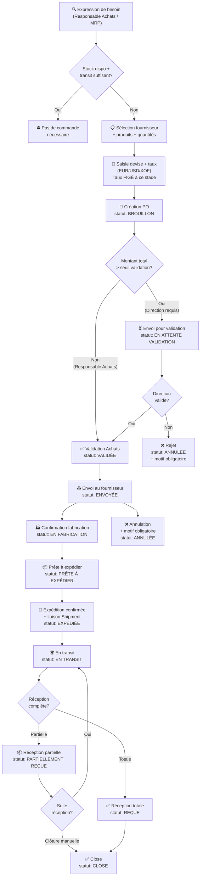

---
id: "LABMEDIS-WF-001"
projet: "LABMEDIS"
type: "workflow"
titre: "WF-001 — Achat International (Commande Fournisseur)"
priorite: "Critique"
statut: "validé"
source_raw: ["raw/PRD_Qwen - 3- Workflows Opérationnels.md §WF-ACH", "raw/PRD_CLAUDE.md §8.3"]
date_creation: "2026-08-28"
date_maj: "2026-08-28"
tags: ["#labmedis", "#workflow", "#achat", "#fournisseur"]
depends_on: ["[[ENT-004-purchase-order]]", "[[ENT-002-supplier]]", "[[FR-002-fournisseurs-achats]]", "[[RG-003-conversion-devise]]"]
---

# WF-001 — Achat International

> [!abstract] 🏛️ Salle du Conseil
> **ARIA :** Le cycle d'achat international LABMEDIS est long (1-3 mois). La machine à états DOIT être irréversible sauf annulation explicite.
> **MARCUS :** Le taux de change DOIT être figé dès la création. Aucun recalcul a posteriori.
> **ZARA :** La validation conditionnelle (seuil montant) est critique — l'absence de validation Direction = risque financier.
> **LEON :** Diagramme avec 12 statuts. Chaque transition = acteur + condition + postcondition.
> **Consensus :** Machine à états complète. Taux figé. Validation conditionnelle.

---

## Diagramme de Flux Principal

---

## Machine à États Complète

| Statut | Acteur déclencheur | Condition(s) | Transitions possibles |
|---|---|---|---|
| `Brouillon` | Resp. Achats | — | → En Attente Validation, Validée, Annulée |
| `En Attente Validation` | Système (auto si montant > seuil) | Montant > seuil configurable | → Validée (Direction), Annulée |
| `Validée` | Resp. Achats ou Direction | — | → Envoyée, Annulée |
| `Envoyée` | Resp. Achats | Confirmation envoi fournisseur | → En Fabrication, Annulée |
| `En Fabrication` | Resp. Achats | Confirmation fournisseur | → Prête à Expédier |
| `Prête à Expédier` | Fournisseur / Resp. Logistique | — | → Expédiée |
| `Expédiée` | Resp. Logistique | Liaison Shipment créée | → En Transit |
| `En Transit` | Resp. Logistique | — | → Partiellement Reçue, Reçue |
| `Partiellement Reçue` | Magasinier | Réception partielle | → En Transit (suite), Close (manuelle) |
| `Reçue` | Magasinier | Réception totale | → Close |
| `Close` | Resp. Achats / Direction | — | (état final) |
| `Annulée` | Resp. Achats / Direction | Motif OBLIGATOIRE | (état final) |

> [!danger] La transition vers `Annulée` EST IRRÉVERSIBLE. Un motif textuel EST REQUIS (champ `cancellation_reason`). L'historique des statuts DOIT être conservé dans `purchase_order_status_history`.

---

## Données de la Commande d'Achat

| Champ | Règle |
|---|---|
| `order_number` | DOIT être unique, généré automatiquement (format: `PO-AAAAMMJJ-NNNN`) |
| `supplier_id` | OBLIGATOIRE, fournisseur actif |
| `currency_id` | OBLIGATOIRE (EUR, USD, XOF) |
| `locked_exchange_rate_id` | FIGÉ à la date de création — JAMAIS recalculé |
| `order_date` | DOIT être la date courante (pas de backdating) |
| `expected_delivery_date` | Calculée auto : order_date + délai fabrication + délai transport |
| `incoterm` | Optionnel mais recommandé (EXW, FOB, CIF, DAP...) |
| `transport_mode` | Maritime / Aérien / Express / Terrestre — impacte coefficients pricing |

**Lignes (purchase_order_lines) :**
| Champ | Règle |
|---|---|
| `product_id` | Produit actif OBLIGATOIRE |
| `quantity` | En unités, > 0 |
| `carton_quantity` | En cartons (optionnel, utilisé pour tracking logistique) |
| `unit_price` | En devise commande — STRING dans le DTO |
| `packaging_type_id` | Référence `product_packagings` |

---

## Règle Taux de Change (Critique)

1. Au moment de la création de la PO, le taux de change actif DOIT être récupéré depuis `exchange_rates`.
2. Ce taux DOIT être enregistré dans `purchase_orders.locked_exchange_rate_id`.
3. Ce taux NE DOIT PAS être recalculé lors des réceptions ultérieures (même si le taux a évolué entre-temps).
4. Le calcul du PRU de chaque lot reçu UTILISE CE TAUX FIGÉ.

> [!warning] INFÉRÉ — Pour USD/XOF : la date de figement retenue est la date de création de la commande. Si LABMEDIS souhaite figer à la date de paiement fournisseur, cela DOIT être clarifié (voir [[99-a-clarifier#BLQ-001]]).

---

## Règle Seuil de Validation

- Le seuil de déclenchement de validation Direction EST CONFIGURABLE par Admin dans `company_profile`.
- Si `montant_total_cfa > seuil_validation` : statut passe automatiquement à `En Attente Validation`.
- Si `montant_total_cfa <= seuil_validation` : le Responsable Achats PEUT valider seul.
- La Direction PEUT toujours valider (même sous le seuil) si elle le souhaite.

---

## Notifications (SignalR)

| Événement | Destinataire | Canal |
|---|---|---|
| PO passée en `En Attente Validation` | Direction | SignalR `order:pendingApproval` |
| PO validée | Resp. Achats | SignalR `order:approved` |
| PO en retard (date prévue dépassée) | Resp. Achats + Direction | SignalR `order:lateDelivery` |
| Réception partielle | Resp. Achats + Magasinier | SignalR `order:partialReceived` |

---

## Postconditions (Réception Terminée)

1. Les lots créés dans `stock_lots` avec statut `En réception` ou `En quarantaine`.
2. Le PRU de chaque lot calculé = PA_CFA × coefficients PricingProfile.
3. Le PMP du produit recalculé → nouvelle ligne dans `product_prices.cump_cfa`.
4. Les mouvements de stock créés (`stock_movements` type `RéceptionFournisseur`).
5. Le statut de la PO passe à `Reçue` ou `Partiellement Reçue`.
6. Notifications SignalR envoyées au rôle `Responsable qualité` pour libération lots.

---

*Source : raw/PRD_Qwen - 3- Workflows Opérationnels.md §WF-ACH | raw/PRD_CLAUDE.md §8.3*
← [[_index|Hub LABMEDIS]] | Suite : [[WF-002-reception-mise-en-stock]]
