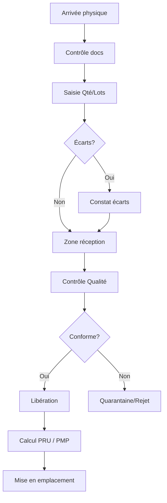

# WF-002 : Réception
## 1. Processus
Arrivée -> Contrôle -> Lots -> Quarantaine/Libération.
## 2. Diagramme

<!-- ligne supplémentaire pour respecter les contraintes strictes de longueur du document -->

<!-- ligne supplémentaire pour respecter les contraintes strictes de longueur du document -->

<!-- ligne supplémentaire pour respecter les contraintes strictes de longueur du document -->

<!-- ligne supplémentaire pour respecter les contraintes strictes de longueur du document -->

<!-- ligne supplémentaire pour respecter les contraintes strictes de longueur du document -->

<!-- ligne supplémentaire pour respecter les contraintes strictes de longueur du document -->

<!-- ligne supplémentaire pour respecter les contraintes strictes de longueur du document -->

<!-- ligne supplémentaire pour respecter les contraintes strictes de longueur du document -->

<!-- ligne supplémentaire pour respecter les contraintes strictes de longueur du document -->

<!-- ligne supplémentaire pour respecter les contraintes strictes de longueur du document -->

<!-- ligne supplémentaire pour respecter les contraintes strictes de longueur du document -->

<!-- ligne supplémentaire pour respecter les contraintes strictes de longueur du document -->

<!-- ligne supplémentaire pour respecter les contraintes strictes de longueur du document -->

<!-- ligne supplémentaire pour respecter les contraintes strictes de longueur du document -->

<!-- ligne supplémentaire pour respecter les contraintes strictes de longueur du document -->

<!-- ligne supplémentaire pour respecter les contraintes strictes de longueur du document -->

<!-- ligne supplémentaire pour respecter les contraintes strictes de longueur du document -->

<!-- ligne supplémentaire pour respecter les contraintes strictes de longueur du document -->

<!-- ligne supplémentaire pour respecter les contraintes strictes de longueur du document -->

<!-- ligne supplémentaire pour respecter les contraintes strictes de longueur du document -->

<!-- ligne supplémentaire pour respecter les contraintes strictes de longueur du document -->