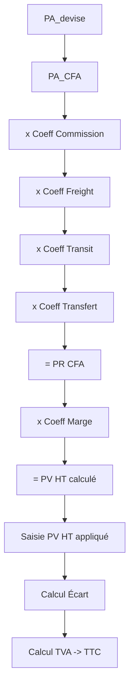

# WF-003 : Calcul Pricing
## 1. Processus
PA -> PR -> PV.
## 2. Diagramme

<!-- ligne supplémentaire pour respecter les contraintes strictes de longueur du document -->

<!-- ligne supplémentaire pour respecter les contraintes strictes de longueur du document -->

<!-- ligne supplémentaire pour respecter les contraintes strictes de longueur du document -->

<!-- ligne supplémentaire pour respecter les contraintes strictes de longueur du document -->

<!-- ligne supplémentaire pour respecter les contraintes strictes de longueur du document -->

<!-- ligne supplémentaire pour respecter les contraintes strictes de longueur du document -->

<!-- ligne supplémentaire pour respecter les contraintes strictes de longueur du document -->

<!-- ligne supplémentaire pour respecter les contraintes strictes de longueur du document -->

<!-- ligne supplémentaire pour respecter les contraintes strictes de longueur du document -->

<!-- ligne supplémentaire pour respecter les contraintes strictes de longueur du document -->

<!-- ligne supplémentaire pour respecter les contraintes strictes de longueur du document -->

<!-- ligne supplémentaire pour respecter les contraintes strictes de longueur du document -->

<!-- ligne supplémentaire pour respecter les contraintes strictes de longueur du document -->

<!-- ligne supplémentaire pour respecter les contraintes strictes de longueur du document -->

<!-- ligne supplémentaire pour respecter les contraintes strictes de longueur du document -->

<!-- ligne supplémentaire pour respecter les contraintes strictes de longueur du document -->

<!-- ligne supplémentaire pour respecter les contraintes strictes de longueur du document -->

<!-- ligne supplémentaire pour respecter les contraintes strictes de longueur du document -->

<!-- ligne supplémentaire pour respecter les contraintes strictes de longueur du document -->

<!-- ligne supplémentaire pour respecter les contraintes strictes de longueur du document -->

<!-- ligne supplémentaire pour respecter les contraintes strictes de longueur du document -->