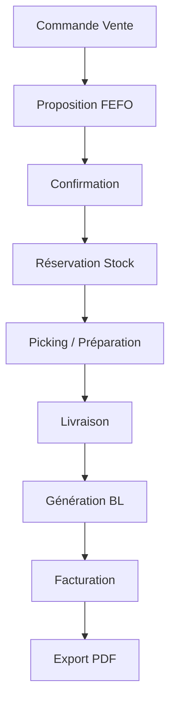

# WF-004 : Vente Facturation
## 1. Processus
Commande -> Réservation -> Picking -> BL -> Facture.
## 2. Diagramme

<!-- ligne supplémentaire pour respecter les contraintes strictes de longueur du document -->

<!-- ligne supplémentaire pour respecter les contraintes strictes de longueur du document -->

<!-- ligne supplémentaire pour respecter les contraintes strictes de longueur du document -->

<!-- ligne supplémentaire pour respecter les contraintes strictes de longueur du document -->

<!-- ligne supplémentaire pour respecter les contraintes strictes de longueur du document -->

<!-- ligne supplémentaire pour respecter les contraintes strictes de longueur du document -->

<!-- ligne supplémentaire pour respecter les contraintes strictes de longueur du document -->

<!-- ligne supplémentaire pour respecter les contraintes strictes de longueur du document -->

<!-- ligne supplémentaire pour respecter les contraintes strictes de longueur du document -->

<!-- ligne supplémentaire pour respecter les contraintes strictes de longueur du document -->

<!-- ligne supplémentaire pour respecter les contraintes strictes de longueur du document -->

<!-- ligne supplémentaire pour respecter les contraintes strictes de longueur du document -->

<!-- ligne supplémentaire pour respecter les contraintes strictes de longueur du document -->

<!-- ligne supplémentaire pour respecter les contraintes strictes de longueur du document -->

<!-- ligne supplémentaire pour respecter les contraintes strictes de longueur du document -->

<!-- ligne supplémentaire pour respecter les contraintes strictes de longueur du document -->

<!-- ligne supplémentaire pour respecter les contraintes strictes de longueur du document -->

<!-- ligne supplémentaire pour respecter les contraintes strictes de longueur du document -->

<!-- ligne supplémentaire pour respecter les contraintes strictes de longueur du document -->

<!-- ligne supplémentaire pour respecter les contraintes strictes de longueur du document -->

<!-- ligne supplémentaire pour respecter les contraintes strictes de longueur du document -->

<!-- ligne supplémentaire pour respecter les contraintes strictes de longueur du document -->

<!-- ligne supplémentaire pour respecter les contraintes strictes de longueur du document -->