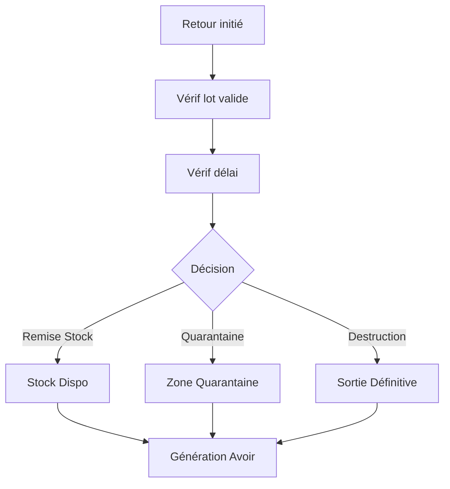

# WF-005 : Retour Client
## 1. Processus
Retour -> Vérif -> Décision -> Avoir.
## 2. Diagramme

<!-- ligne supplémentaire pour respecter les contraintes strictes de longueur du document -->

<!-- ligne supplémentaire pour respecter les contraintes strictes de longueur du document -->

<!-- ligne supplémentaire pour respecter les contraintes strictes de longueur du document -->

<!-- ligne supplémentaire pour respecter les contraintes strictes de longueur du document -->

<!-- ligne supplémentaire pour respecter les contraintes strictes de longueur du document -->

<!-- ligne supplémentaire pour respecter les contraintes strictes de longueur du document -->

<!-- ligne supplémentaire pour respecter les contraintes strictes de longueur du document -->

<!-- ligne supplémentaire pour respecter les contraintes strictes de longueur du document -->

<!-- ligne supplémentaire pour respecter les contraintes strictes de longueur du document -->

<!-- ligne supplémentaire pour respecter les contraintes strictes de longueur du document -->

<!-- ligne supplémentaire pour respecter les contraintes strictes de longueur du document -->

<!-- ligne supplémentaire pour respecter les contraintes strictes de longueur du document -->

<!-- ligne supplémentaire pour respecter les contraintes strictes de longueur du document -->

<!-- ligne supplémentaire pour respecter les contraintes strictes de longueur du document -->

<!-- ligne supplémentaire pour respecter les contraintes strictes de longueur du document -->

<!-- ligne supplémentaire pour respecter les contraintes strictes de longueur du document -->

<!-- ligne supplémentaire pour respecter les contraintes strictes de longueur du document -->

<!-- ligne supplémentaire pour respecter les contraintes strictes de longueur du document -->

<!-- ligne supplémentaire pour respecter les contraintes strictes de longueur du document -->

<!-- ligne supplémentaire pour respecter les contraintes strictes de longueur du document -->

<!-- ligne supplémentaire pour respecter les contraintes strictes de longueur du document -->

<!-- ligne supplémentaire pour respecter les contraintes strictes de longueur du document -->