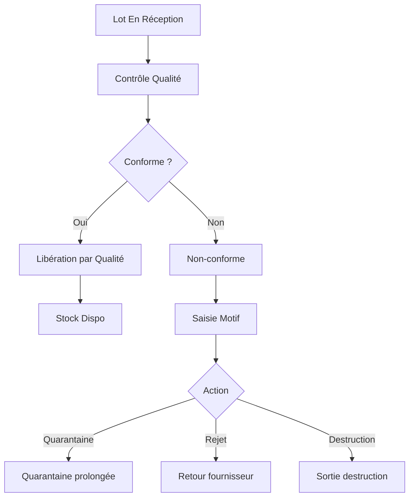

# WF-008 : Contrôle Qualité
## 1. Diagramme

<!-- ligne supplémentaire pour respecter les contraintes strictes de longueur du document -->

<!-- ligne supplémentaire pour respecter les contraintes strictes de longueur du document -->

<!-- ligne supplémentaire pour respecter les contraintes strictes de longueur du document -->

<!-- ligne supplémentaire pour respecter les contraintes strictes de longueur du document -->

<!-- ligne supplémentaire pour respecter les contraintes strictes de longueur du document -->

<!-- ligne supplémentaire pour respecter les contraintes strictes de longueur du document -->

<!-- ligne supplémentaire pour respecter les contraintes strictes de longueur du document -->

<!-- ligne supplémentaire pour respecter les contraintes strictes de longueur du document -->

<!-- ligne supplémentaire pour respecter les contraintes strictes de longueur du document -->

<!-- ligne supplémentaire pour respecter les contraintes strictes de longueur du document -->

<!-- ligne supplémentaire pour respecter les contraintes strictes de longueur du document -->

<!-- ligne supplémentaire pour respecter les contraintes strictes de longueur du document -->

<!-- ligne supplémentaire pour respecter les contraintes strictes de longueur du document -->

<!-- ligne supplémentaire pour respecter les contraintes strictes de longueur du document -->

<!-- ligne supplémentaire pour respecter les contraintes strictes de longueur du document -->

<!-- ligne supplémentaire pour respecter les contraintes strictes de longueur du document -->

<!-- ligne supplémentaire pour respecter les contraintes strictes de longueur du document -->

<!-- ligne supplémentaire pour respecter les contraintes strictes de longueur du document -->

<!-- ligne supplémentaire pour respecter les contraintes strictes de longueur du document -->

<!-- ligne supplémentaire pour respecter les contraintes strictes de longueur du document -->

<!-- ligne supplémentaire pour respecter les contraintes strictes de longueur du document -->

<!-- ligne supplémentaire pour respecter les contraintes strictes de longueur du document -->

<!-- ligne supplémentaire pour respecter les contraintes strictes de longueur du document -->